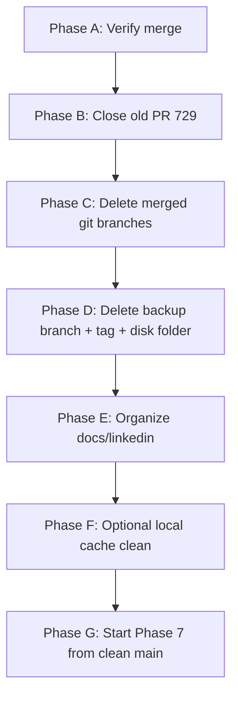

# Post-Merge Cleanup Plan — After LinkedIn PR Success

## Document Information

| Field | Value |
|-------|-------|
| **Date** | 2026-06-21 |
| **Status** | Ready to execute (no code changes in this doc) |
| **Prerequisite** | LinkedIn Phases 1–6 **merged** into `ALwrity/main` |
| **Your local `main`** | `f74ffd13` — synced with team |
| **Supersedes** | [PR_729_BRANCH_RECOVERY_PLAN.md](./archive/recovery-2026-06/PR_729_BRANCH_RECOVERY_PLAN.md) (recovery complete) |
| **Next work after cleanup** | [PHASE_7_IMPLEMENTATION_PLAN.md](./linkedin-profile-recommendation-editing/PHASE_7_IMPLEMENTATION_PLAN.md) |

---

## 1. Plain English — What We Are Cleaning and Why

You went through a **recovery rescue** (backup → fresh main → clean PR). That created **safety copies** on purpose. Now your LinkedIn work lives on **team `main`**. The extra copies are **no longer needed for daily work** — they only add confusion.

**Cleanup goal:** One clean `main`, one clear workflow, keep docs you still need for Phase 7, remove old branches and backups.

**Cleanup is NOT deleting your merged code.** Your merged work is safe on `ALwrity/main`.

---

## 2. Current Mess Inventory (What Exists Today)

### A. Git branches on your fork (local + GitHub)

| Branch | What it is | Safe to remove? |
|--------|------------|-----------------|
| **`main`** | Team code + your merged LinkedIn work | **KEEP** — your daily base |
| **`feat/linkedin-unipile-phases-1-6`** | Old PR branch (merged) | **DELETE** — work is on `main` |
| **`backup/pr729-full-work-2026-06-20`** | Full snapshot from recovery Step 1 | **DELETE** (after Phase A verify) |
| **`feature/linkedin-analytics-landing`** | Old mixed branch (analytics + stale base) | **ARCHIVE then DELETE** — analytics UI deferred to future PR |

Also: **branch + tag** both named `backup/pr729-full-work-2026-06-20` → causes git “ambiguous refname” warnings. Clean both.

### B. Disk folder outside repo

| Path | What it is | Safe to remove? |
|------|------------|-----------------|
| `c:\alwrity-tool\ALwrity-LINKEDIN-BACKUP-2026-06-20\` | 132 exported files from recovery | **DELETE** after git backup branch removed |

### C. GitHub PRs

| PR | Action |
|----|--------|
| **Old [#729](https://github.com/ALwrity/ALwrity/pull/729)** | **Close** with note: superseded and merged via clean PR |
| **New merged PR** | No action — already on `main` |

### D. Local docs (`docs/linkedin/` — **not in git today**)

~30 planning/RCA/fix docs on your PC only. Team cannot see them until committed.

| Category | Examples | Cleanup action |
|----------|----------|----------------|
| **Keep for Phase 7** | `PHASE_7_IMPLEMENTATION_PLAN.md`, `LINKEDIN_PROFILE_OPTIMIZATION_RECOMMENDATION_PLAN.md`, profile best practices | **KEEP** on disk; commit in optional docs PR |
| **Keep as reference** | `DAILY_GIT_CHECKLIST.md`, phase 1–6 specs, Unipile API mapping | **KEEP**; commit useful ones |
| **Archive (historical)** | `PR_729_BRANCH_RECOVERY_PLAN.md`, RCA/fix plans from debugging (`RCA_UNIPILE_*`, connection fix plans) | **Move to** `docs/linkedin/archive/recovery-2026-06/` — not deleted, just filed away |
| **Duplicate / obsolete** | Old PR template versions if duplicated | **Merge or delete** duplicates only |

### E. Local dev artifacts (normal, not “mess”)

| Item | Action |
|------|--------|
| `backend/.env`, `frontend/.env` | **KEEP forever** — never commit |
| `workspace/` | **KEEP** — your personal DBs |
| `myenv/` | **KEEP** — Python venv |
| `__pycache__/`, `.pytest_cache/` | **Optional delete** — regenerates automatically |

### F. What you do **NOT** touch

- Merged code on `main`
- `.env` secrets
- `workspace/` user data
- Anything on `ALwrity/main` (upstream) — you only clean **your fork and local machine**

---

## 3. Cleanup Phases (Order Matters)



---

## Phase A — Verify Everything Is Really Merged (5 min)

**Why:** Do not delete backups until you confirm team `main` has your work.

**Check:**

```powershell
cd c:\alwrity-tool\ALwrity
git fetch upstream
git checkout main
git pull upstream main
git push origin main
```

**Pass if all true:**

- [ ] `git rev-parse main` = `git rev-parse upstream/main`
- [ ] LinkedIn Writer manual test still works (connect + Topic Suggestion)
- [ ] You see your commits on GitHub `ALwrity/ALwrity` main history:
  - `feat(linkedin): restore Unipile Phases 1-6…`
  - `fix(linkedin): close OAuth popup…`

---

## Phase B — Close GitHub PR #729 (2 min)

**Why:** Avoid reviewers confusing old 104-file PR with merged work.

On GitHub:

1. Open [#729](https://github.com/ALwrity/ALwrity/pull/729)
2. If still **Open** → **Close pull request**
3. Comment:

   > Superseded and merged. LinkedIn Phases 1–6 landed on `ALwrity/main` via clean rebase PR. Closing to avoid confusion.

**Do not** delete the PR — closed PRs are useful history.

---

## Phase C — Delete Merged Feature Branch (5 min)

**Why:** `feat/linkedin-unipile-phases-1-6` is merged. Keeping it causes accidental work on a dead branch.

**When:** After Phase A passes.

```powershell
cd c:\alwrity-tool\ALwrity
git checkout main

# Delete local
git branch -d feat/linkedin-unipile-phases-1-6

# Delete on your fork (GitHub)
git push origin --delete feat/linkedin-unipile-phases-1-6
```

**If `-d` refuses:** branch was not fully merged locally (different commit SHAs after squash). Use `-D` only after confirming Phase A.

---

## Phase D — Remove Recovery Backups (10 min)

**Why:** Backup existed only for the rescue. Merged code + git history on `main` replaces it.

**When:** At least **7 days** after Phase A, OR immediately if you are confident and manual test passed twice.

### D1. Analytics branch — decide first

`feature/linkedin-analytics-landing` has **analytics UI** not yet merged.

| Option | When |
|--------|------|
| **Keep branch** until analytics PR | You plan analytics soon |
| **Delete branch** | Backup branch still has code; extract analytics later from backup if needed |

**Recommendation:** Keep **only** `feature/linkedin-analytics-landing` until analytics PR is opened. Delete everything else in Phase D.

### D2. Delete backup branch + tag

```powershell
# Delete local backup branch
git branch -D backup/pr729-full-work-2026-06-20

# Delete remote backup branch on fork
git push origin --delete backup/pr729-full-work-2026-06-20

# Delete ambiguous tag (use full ref)
git tag -d backup/pr729-full-work-2026-06-20
git push origin :refs/tags/backup/pr729-full-work-2026-06-20
```

### D3. Delete disk backup folder

```powershell
Remove-Item -Recurse -Force "c:\alwrity-tool\ALwrity-LINKEDIN-BACKUP-2026-06-20"
```

**Only after** D2 succeeds. This folder cannot be recovered except from git backup branch (which you just deleted) — so run D3 last.

---

## Phase E — Organize `docs/linkedin/` (20–30 min)

**Why:** ~30 doc files are local-only and mixed (Phase 7 plans + old RCA + recovery). Clean structure before Phase 7.

**Target structure:**

```
docs/linkedin/
├── DAILY_GIT_CHECKLIST.md              ← keep
├── linkedin-analysis-context/          ← keep (Phases 1–6 specs)
├── linkedin-profile-recommendation-editing/  ← keep (Phase 7)
├── linkedin-profile-best-practices/    ← keep
├── unipile/                            ← keep active reference docs
├── archive/
│   └── recovery-2026-06/
│       ├── PR_729_BRANCH_RECOVERY_PLAN.md
│       ├── fixtures/                   ← old fix plans
│       └── unipile/RCA_*.md            ← debug RCAs from incident
└── unipile/PULL_REQUEST_TEMPLATE.md    ← update for Phase 7 PRs later
```

**Actions:**

1. Create `docs/linkedin/archive/recovery-2026-06/`
2. Move recovery + RCA + one-time fix plans into `archive/`
3. Keep Phase 7 plans at top level paths (no move)
4. **Optional:** Open small docs-only PR to commit `docs/linkedin/` so team shares Phase 7 plans

**Why archive instead of delete:** RCAs helped you debug; useful if Unipile issues return. They should not clutter active planning folders.

---

## Phase F — Optional Local Cache Clean (5 min)

**Why:** Frees disk space; zero impact on code.

```powershell
cd c:\alwrity-tool\ALwrity
Get-ChildItem -Path . -Include __pycache__ -Recurse -Directory | Remove-Item -Recurse -Force
Remove-Item -Recurse -Force .pytest_cache, backend\.pytest_cache -ErrorAction SilentlyContinue
```

**Never delete:** `workspace/`, `.env`, `myenv/`

---

## Phase G — Prune Stale Remote Tracking Branches (2 min)

**Why:** After deleting fork branches, local git still lists old `remotes/origin/...` refs.

```powershell
git fetch origin --prune
git remote prune origin
```

---

## 4. Cleanup Checklist (Copy When Executing)

| Step | Action | Done? |
|------|--------|-------|
| A | Verify `main` = `upstream/main` + manual LinkedIn test | ☐ |
| B | Close PR #729 on GitHub | ☐ |
| C | Delete `feat/linkedin-unipile-phases-1-6` (local + origin) | ☐ |
| D1 | Decide: keep or delete `feature/linkedin-analytics-landing` | ☐ |
| D2 | Delete `backup/pr729-full-work-2026-06-20` branch + tag | ☐ |
| D3 | Delete disk folder `ALwrity-LINKEDIN-BACKUP-2026-06-20` | ☐ |
| E | Archive old RCA/recovery docs under `archive/recovery-2026-06/` | ☐ |
| E+ | Optional: commit `docs/linkedin/` in docs PR | ☐ |
| F | Optional: clear `__pycache__` | ☐ |
| G | `git fetch --prune` | ☐ |

---

## 5. After Cleanup — Normal Workflow (Going Forward)

Use [DAILY_GIT_CHECKLIST.md](./DAILY_GIT_CHECKLIST.md) every day:

1. `git fetch upstream` → update `main`
2. Branch from `upstream/main` for new work
3. Small focused PRs (one feature each)
4. Never develop on `main` directly

**Start Phase 7:**

```powershell
git checkout main
git pull upstream main
git checkout -b feat/linkedin-phase-7-profile-optimization upstream/main
```

Follow [PHASE_7_IMPLEMENTATION_PLAN.md](./linkedin-profile-recommendation-editing/PHASE_7_IMPLEMENTATION_PLAN.md).

---

## 6. Risk Table — What If You Delete Too Early?

| If you delete… | Risk | Mitigation |
|----------------|------|------------|
| Backup branch before verifying merge | Lose old 104-file snapshot | Phase A manual test first |
| `feature/linkedin-analytics-landing` | Lose analytics UI code | Extract from backup before delete, or keep branch |
| `docs/linkedin/` RCA files | Lose debug history | **Archive**, don’t delete |
| `.env` / `workspace/` | Break local dev | **Never delete** |

---

## 7. Estimated Time

| Phase | Time |
|-------|------|
| A–B | 10 min |
| C–D | 15 min |
| E | 20–30 min |
| F–G | 5 min |
| **Total** | **~45–60 min** |

---

## 8. One-Line Summary

> **Verify merge → close #729 → delete merged + backup branches → archive old docs → keep `.env`/workspace → branch fresh for Phase 7.**

Your merged LinkedIn code stays on `main`. Cleanup removes **safety nets and clutter**, not your product work.

---

## Related Documents

| Doc | Purpose |
|-----|---------|
| [PR_729_BRANCH_RECOVERY_PLAN.md](./archive/recovery-2026-06/PR_729_BRANCH_RECOVERY_PLAN.md) | Historical — how we rescued the stale PR |
| [DAILY_GIT_CHECKLIST.md](./DAILY_GIT_CHECKLIST.md) | Daily sync routine |
| [PHASE_7_IMPLEMENTATION_PLAN.md](./linkedin-profile-recommendation-editing/PHASE_7_IMPLEMENTATION_PLAN.md) | Next implementation |
