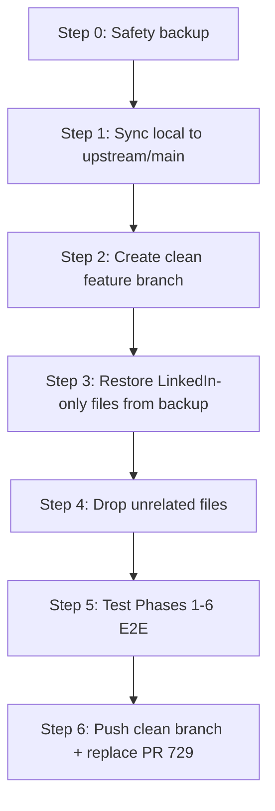

# PR #729 Branch Recovery Plan — Save LinkedIn Writer Work, Sync With Upstream

## Document Information

| Field | Value |
|-------|-------|
| **Date** | 2026-06-20 |
| **Status** | Action plan — no code changes yet |
| **Affected PR** | [ALwrity/ALwrity#729](https://github.com/ALwrity/ALwrity/pull/729) |
| **Your fork** | `uniqueumesh/ALwrity` (`origin`) |
| **Upstream** | `ALwrity/ALwrity` (`upstream`) |
| **Goal** | Preserve LinkedIn Writer work, drop stale unrelated diffs, rebase onto current `upstream/main`, open a clean focused PR |

---

## 1. What Happened (Plain English)

You spent a week building **LinkedIn Writer** features (Unipile connect + Phases 1–6 analysis pipeline). That work lives on your fork’s `main` branch and is submitted as **PR #729**.

The problem:

1. Your branch was created from an **old snapshot** of `ALwrity/main`.
2. While you worked, upstream moved forward by **~41 commits** (content strategy fixes, blog writer, OAuth framework, tenant ownership, streaming cache, etc.).
3. Your PR therefore shows **104 changed files**, but only **~75–80 are LinkedIn-related**. The rest are fixes you made locally that **upstream already merged** (or superseded) on its own.
4. Merging PR #729 as-is would either **fail with conflicts** or **revert/duplicate** upstream fixes.

**Your work is not lost.** It is safely in git history on your fork (`origin/main`, commit `a909d24b`). We need to **extract LinkedIn-only changes** and **re-apply them on top of fresh upstream**, not throw away a week of work.

---

## 2. Current State (Verified)

| Metric | Value |
|--------|-------|
| Local branch | `main` (clean working tree) |
| Sync with your fork | `origin/main` — **in sync** |
| Commits **ahead** of `upstream/main` | **17** (your LinkedIn work) |
| Commits **behind** `upstream/main` | **41** (upstream moved on) |
| Files in PR diff | **104** |
| Files with no LinkedIn/Unipile in path | **~24** (likely stale / unrelated) |
| Upstream LinkedIn integration folder | **Does not exist yet** — your LinkedIn backend is genuinely new |

### Your 17 commits (grouped by intent)

| Group | Commits | Keep? |
|-------|---------|-------|
| **Unipile + Phases 1–6** (core LinkedIn Writer) | `1f52e93` → `ad79e83` (+ Phase 1–6 chain) | **YES — primary value** |
| **Import fix** | `30f661c7` | **YES** |
| **LinkedIn Analytics landing** | `940e60c2`, `abf923f0`, `672bf709`, merge `93a7ea6b` | **OPTIONAL — separate PR recommended** |
| **Old upstream merges** | `aec1ff7b`, `a909d24b` | **NO — replaced by fresh rebase** |

---

## 3. Recovery Strategy (High Level)



**Golden rule:** Never delete your backup until the new PR passes review and E2E testing.

---

## 4. Step-by-Step Execution Plan

### Step 0 — Safety Backup (Do This First, ~5 min)

Create **two** backups so you can always recover:

#### 0a. Git backup branch + tag

```powershell
cd c:\alwrity-tool\ALwrity

# Ensure upstream remote exists
git remote add upstream https://github.com/ALwrity/ALwrity.git 2>$null
git fetch upstream
git fetch origin

# Immutable backup of ALL current work
git branch backup/pr729-full-work-2026-06-20 HEAD
git tag backup/pr729-full-work-2026-06-20 HEAD

# Push backup to your fork (off-site safety)
git push origin backup/pr729-full-work-2026-06-20
git push origin backup/pr729-full-work-2026-06-20
```

#### 0b. File archive (optional but recommended)

Export every changed file to a folder outside the repo:

```powershell
$backupDir = "c:\alwrity-tool\ALwrity-LINKEDIN-BACKUP-2026-06-20"
New-Item -ItemType Directory -Force -Path $backupDir

git diff --name-only upstream/main...HEAD | ForEach-Object {
    $dest = Join-Path $backupDir $_
    New-Item -ItemType Directory -Force -Path (Split-Path $dest) | Out-Null
    git show "HEAD:$_" | Set-Content -Path $dest -Encoding utf8
}

# Save file list + commit log
git diff --name-only upstream/main...HEAD | Out-File "$backupDir\ALL_CHANGED_FILES.txt"
git log --oneline upstream/main..HEAD | Out-File "$backupDir\COMMITS.txt"
```

#### 0c. Preserve local docs (not all are in the PR)

Copy manually if untracked:

- `docs/linkedin/` (all phase plans, Unipile docs, Phase 7 plan)
- Your `.env` files (never commit — keep locally)

---

### Step 1 — Reset Local `main` to Upstream (~2 min)

This makes your local codebase match the **current** ALwrity team code.

```powershell
cd c:\alwrity-tool\ALwrity

git checkout main
git reset --hard upstream/main

# Update your fork's main (requires force push — coordinate with team if others use your fork)
git push origin main --force-with-lease
```

> **Note:** Force-pushing `main` on your fork is OK here because PR #729 will be replaced by a clean branch. Your full work remains on `backup/pr729-full-work-2026-06-20`.

---

### Step 2 — Create a Clean Feature Branch (~1 min)

```powershell
git checkout -b feat/linkedin-unipile-phases-1-6 upstream/main
```

**Recommended:** Keep analytics work for a **second branch** later:

```powershell
# After Phase 1-6 PR merges:
git checkout -b feat/linkedin-analytics-landing backup/pr729-full-work-2026-06-20
# Then cherry-pick only analytics commits (see Section 6)
```

---

### Step 3 — Restore LinkedIn-Only Files From Backup

Use the backup branch — **do not manually re-type code**.

#### Option A — Recommended: Checkout file groups from backup branch

```powershell
git checkout backup/pr729-full-work-2026-06-20 -- `
  backend/api/linkedin_social_routes.py `
  backend/api/unipile_webhook_routes.py `
  backend/models/linkedin_social_models.py `
  backend/prompts/linkedin `
  backend/scripts/linkedin_fetch_profile.py `
  backend/services/integrations/linkedin `
  backend/services/integrations/linkedin_oauth.py `
  frontend/src/api/linkedinSocial.ts `
  frontend/src/utils/linkedInOAuthConnect.ts `
  frontend/src/hooks/useLinkedInSocialConnection.ts `
  frontend/src/hooks/useLinkedInProfileCompletion.ts `
  frontend/src/components/LinkedInWriter
```

Then add **partial/shared files** one at a time (Section 5):

```powershell
# Gemini schema fix (needed for Phases 5 & 6)
git checkout backup/pr729-full-work-2026-06-20 -- backend/services/llm_providers/gemini_provider.py

# Router registration (LinkedIn social + Unipile webhook only)
git checkout backup/pr729-full-work-2026-06-20 -- backend/alwrity_utils/router_manager.py
```

Review `router_manager.py` diff — it should only add `linkedin_social` and `unipile_webhook` entries. Revert any accidental unrelated edits.

#### Option B — Cherry-pick commits (harder due to merge commits)

Cherry-pick the linear Phase 1–6 commits in order:

```
30f661c7 → 1f52e939 → 15ff32f6 → 3bd42c78 → eedb2912 → a383c62e →
8d844f55 → c5eab2f2 → 2d47b2a3 → 6092c887 → ad79e83a
```

Skip merge commits (`aec1ff7b`, `93a7ea6b`, `a909d24b`). Expect conflicts in shared files — resolve using Section 5.

---

### Step 4 — Explicitly DROP Unrelated Files

**Do not restore these from backup.** Upstream already has better versions.

| File | Why drop |
|------|----------|
| `backend/api/content_planning/api/content_strategy/endpoints/ai_generation_endpoints.py` | Content strategy — upstream fixed (streaming cache, tenant ownership, TTL, etc.) |
| `backend/api/content_planning/api/content_strategy/endpoints/streaming_endpoints.py` | Same |
| `backend/api/content_planning/services/content_strategy/performance/caching.py` | Same |
| `backend/api/oauth_token_monitoring_routes.py` | OAuth monitoring already on upstream |
| `backend/models/oauth_token_monitoring_models.py` | Same |
| `backend/services/oauth_token_monitoring_service.py` | Same |
| `backend/services/scheduler/executors/oauth_token_monitoring_executor.py` | Same |
| `backend/api/scheduler_dashboard.py` | Unrelated scheduler UI |
| `backend/services/research/trends/google_trends_service.py` | Unrelated |
| `backend/services/seo_tools/gsc_analyzer_service.py` | Unrelated |
| `frontend/src/components/OAuthTokenMonitoring/OAuthTokenStatusPanel.tsx` | Already upstream |
| `frontend/src/components/SchedulerDashboard/OAuthTokenStatus.tsx` | Already upstream |
| `ngrok.exe` | **Never commit** — local dev tool only |

After restore, verify nothing unrelated crept in:

```powershell
git diff --name-only upstream/main...HEAD
# Expect ~75-85 files, NOT 104
```

---

### Step 5 — Review PARTIAL / Shared Files (Manual Triage)

These files changed in PR #729 but serve **both** LinkedIn and non-LinkedIn purposes. After restoring from backup, **diff against upstream** and keep **only LinkedIn lines**.

| File | What to keep | What to drop |
|------|--------------|--------------|
| `backend/alwrity_utils/router_manager.py` | `linkedin_social`, `unipile_webhook` router entries | Any other edits |
| `backend/main.py` | Nothing unless LinkedIn router include is missing | Old `OnboardingManager is None` guard — upstream may handle differently |
| `backend/requirements.txt` | New packages for Unipile / LinkedIn only | Duplicate or conflicting version bumps |
| `backend/conftest.py` | LinkedIn test fixtures only | Unrelated fixture changes |
| `backend/prompts/__init__.py` | LinkedIn prompt exports only | Other prompt changes |
| `frontend/src/api/client.ts` | Extended timeout for `GET /profile` if present | Other client changes |
| `frontend/package-lock.json` | Regenerate via `npm install` after frontend deps settle | Blind copy from old branch |
| `frontend/src/components/OnboardingWizard/IntegrationsStep.tsx` | Unipile LinkedIn connect wiring | Non-LinkedIn platform changes |
| `frontend/src/components/OnboardingWizard/common/PlatformSection.tsx` | LinkedIn card slot | Other platform edits |
| `frontend/src/components/OnboardingWizard/common/usePlatformConnections.ts` | LinkedIn connection state | Other providers |
| `.gitignore` | Ignore patterns for LinkedIn workspace artifacts | Do not revert upstream ignore rules |

**How to triage one file:**

```powershell
git diff upstream/main HEAD -- backend/main.py
# Keep hunks that mention linkedin, unipile, linkedin_social only
```

---

### Step 6 — LinkedIn Analytics (Optional Second PR)

These files are **LinkedIn-related but separate feature scope** from Phases 1–6:

| Backend | Frontend |
|---------|----------|
| `personal_analytics.py` | `components/analytics/*` (8 files) |
| `landing_analytics.py` | `useLinkedInAnalyticsDashboard.ts` |
| `analytics_dates.py` | |
| `analytics_normalizer.py` | |

**Recommendation:** Ship Phases 1–6 first (Topic Suggestion E2E). Add analytics in PR #2 from backup branch commits `940e60c2`, `abf923f0`, `672bf709`.

---

### Step 7 — Test Before Pushing (~30–60 min)

#### Backend

```powershell
cd backend
python -m pytest tests/services/integrations/linkedin/test_topic_recommendation_validator.py -v
python -m pytest tests/services/integrations/linkedin/test_topic_recommendation_service.py -v
python -m pytest tests/services/llm_providers/test_gemini_schema_conversion.py -v
python -m pytest tests/api/test_linkedin_profile_route.py -v
```

#### Manual E2E (from PR #729 test plan)

1. Connect LinkedIn via Unipile OAuth popup
2. Open LinkedIn Writer → connected profile card renders
3. Click **Topic Suggestion** → Phases 1–6 → 5 recommendation cards
4. Incomplete profile → completion form → pipeline resumes
5. Induce LLM failure → structured `analysis_error` + Retry
6. `refresh_recommendations=true` → new topics
7. Disconnect → reconnect → clean Phase 1 restart

#### Regression smoke (upstream areas you previously touched)

- Content Strategy streaming (ensure you did NOT re-introduce old caching code)
- OAuth token monitoring dashboard (should be upstream version)
- Blog writer / onboarding (quick sanity check)

---

### Step 8 — Push Clean Branch and Replace PR #729

```powershell
git push -u origin feat/linkedin-unipile-phases-1-6
```

Then on GitHub:

1. **Close PR #729** with comment: *"Superseded by clean rebase onto current main — LinkedIn-only diff."*
2. **Open new PR** `feat/linkedin-unipile-phases-1-6` → `ALwrity/main`
3. New PR should show **~75–85 files**, not 104
4. Link old PR for reviewer context
5. Re-request review from `@AJaySi`, `@rajbhati`, `@deepanshuwadhwa7`

---

## 5. Complete File Classification (All 104 PR Files)

### 5A — KEEP (Core LinkedIn Writer — Phases 1–6 + Unipile)

**Backend (47 files)**

```
backend/api/linkedin_social_routes.py
backend/api/unipile_webhook_routes.py
backend/models/linkedin_social_models.py
backend/prompts/linkedin/__init__.py
backend/prompts/linkedin/profile_intelligence_prompt.py
backend/prompts/linkedin/topic_recommendation_prompt.py
backend/scripts/linkedin_fetch_profile.py
backend/services/integrations/linkedin_oauth.py
backend/services/integrations/linkedin/__init__.py
backend/services/integrations/linkedin/account_resolution.py
backend/services/integrations/linkedin/content_deduplicator.py
backend/services/integrations/linkedin/exceptions.py
backend/services/integrations/linkedin/factory.py
backend/services/integrations/linkedin/field_coercion.py
backend/services/integrations/linkedin/media_validator.py
backend/services/integrations/linkedin/native_provider.py
backend/services/integrations/linkedin/profile_completion_questions.py
backend/services/integrations/linkedin/profile_completion_service.py
backend/services/integrations/linkedin/profile_context_builder.py
backend/services/integrations/linkedin/profile_context_patcher.py
backend/services/integrations/linkedin/profile_context_service.py
backend/services/integrations/linkedin/profile_context_types.py
backend/services/integrations/linkedin/profile_intelligence_llm.py
backend/services/integrations/linkedin/profile_intelligence_service.py
backend/services/integrations/linkedin/profile_intelligence_types.py
backend/services/integrations/linkedin/profile_intelligence_validator.py
backend/services/integrations/linkedin/profile_repository.py
backend/services/integrations/linkedin/profile_service.py
backend/services/integrations/linkedin/profile_validation_service.py
backend/services/integrations/linkedin/profile_validation_types.py
backend/services/integrations/linkedin/profile_validator.py
backend/services/integrations/linkedin/protocol.py
backend/services/integrations/linkedin/publish_preflight.py
backend/services/integrations/linkedin/topic_recommendation_llm.py
backend/services/integrations/linkedin/topic_recommendation_service.py
backend/services/integrations/linkedin/topic_recommendation_types.py
backend/services/integrations/linkedin/topic_recommendation_validator.py
backend/services/integrations/linkedin/types.py
backend/services/integrations/linkedin/unipile_client.py
backend/services/integrations/linkedin/unipile_provider.py
backend/services/integrations/linkedin/zernio_client.py
backend/services/integrations/linkedin/zernio_provider.py
backend/services/llm_providers/gemini_provider.py
```

**Frontend (22 files — excluding analytics subfolder)**

```
frontend/src/api/linkedinSocial.ts
frontend/src/utils/linkedInOAuthConnect.ts
frontend/src/hooks/useLinkedInSocialConnection.ts
frontend/src/hooks/useLinkedInProfileCompletion.ts
frontend/src/components/LinkedInWriter/LinkedInWriter.tsx
frontend/src/components/LinkedInWriter/components/LinkedInConnectedProfile.tsx
frontend/src/components/LinkedInWriter/components/LinkedInConnectedProfileCard.tsx
frontend/src/components/LinkedInWriter/components/LinkedInConnectionPlaceholder.tsx
frontend/src/components/LinkedInWriter/components/ProfileCompletion/LinkedInProfileSetupPanel.tsx
frontend/src/components/LinkedInWriter/components/ProfileCompletion/ProfileCompletionForm.tsx
frontend/src/components/LinkedInWriter/components/PublishLinkedInPanel.tsx
frontend/src/components/LinkedInWriter/components/TopicRecommendations/TopicRecommendationCard.tsx
frontend/src/components/LinkedInWriter/components/TopicRecommendations/TopicRecommendationsPanel.tsx
frontend/src/components/LinkedInWriter/components/TopicRecommendations/TopicSuggestionIntro.tsx
frontend/src/components/LinkedInWriter/components/TopicRecommendations/topicRecommendationLabels.ts
frontend/src/components/LinkedInWriter/components/WelcomeMessage.tsx
frontend/src/components/LinkedInWriter/components/index.ts
frontend/src/components/LinkedInWriter/components/linkedInPlaceholderStyles.ts
frontend/src/components/LinkedInWriter/utils/firstCommentUtils.ts
frontend/src/components/LinkedInWriter/utils/linkedInProfileSummary.ts
frontend/src/components/OnboardingWizard/common/LinkedInPlatformCard.tsx
```

**Docs in PR (3 files — keep)**

```
docs/LINKEDIN_WRITER_MULTIMEDIA_REVAMP.md
docs/README_LINKEDIN_MIGRATION.md
docs/linkedin_factual_google_grounded_url_content.md
```

---

### 5B — DEFER (LinkedIn Analytics — separate PR)

```
backend/services/integrations/linkedin/analytics_dates.py
backend/services/integrations/linkedin/analytics_normalizer.py
backend/services/integrations/linkedin/landing_analytics.py
backend/services/integrations/linkedin/personal_analytics.py
frontend/src/hooks/useLinkedInAnalyticsDashboard.ts
frontend/src/components/LinkedInWriter/components/analytics/AnalyticsDateRangeLabel.tsx
frontend/src/components/LinkedInWriter/components/analytics/AnalyticsDateRangePicker.tsx
frontend/src/components/LinkedInWriter/components/analytics/AnalyticsEmptyState.tsx
frontend/src/components/LinkedInWriter/components/analytics/AnalyticsMetricGrid.tsx
frontend/src/components/LinkedInWriter/components/analytics/AvatarTabSwitcher.tsx
frontend/src/components/LinkedInWriter/components/analytics/LinkedInAnalyticsDashboard.tsx
frontend/src/components/LinkedInWriter/components/analytics/analyticsDateRangeUtils.ts
frontend/src/components/LinkedInWriter/components/analytics/analyticsMetricConfig.ts
```

---

### 5C — DROP (Unrelated or already fixed upstream)

```
.gitignore                                          ← review only; prefer upstream
backend/api/content_planning/.../ai_generation_endpoints.py
backend/api/content_planning/.../streaming_endpoints.py
backend/api/content_planning/.../performance/caching.py
backend/api/oauth_token_monitoring_routes.py
backend/api/scheduler_dashboard.py
backend/conftest.py                                 ← review; likely drop
backend/main.py                                     ← review; likely drop onboarding guard
backend/models/oauth_token_monitoring_models.py
backend/prompts/__init__.py                         ← review; linkedin exports only
backend/requirements.txt                            ← add linkedin deps manually
backend/services/oauth_token_monitoring_service.py
backend/services/research/trends/google_trends_service.py
backend/services/scheduler/executors/oauth_token_monitoring_executor.py
backend/services/seo_tools/gsc_analyzer_service.py
frontend/package-lock.json                          ← regenerate, don't copy
frontend/src/api/client.ts                          ← review timeout hunk only
frontend/src/components/OAuthTokenMonitoring/OAuthTokenStatusPanel.tsx
frontend/src/components/OnboardingWizard/IntegrationsStep.tsx        ← partial
frontend/src/components/OnboardingWizard/common/PlatformSection.tsx  ← partial
frontend/src/components/OnboardingWizard/common/usePlatformConnections.ts ← partial
frontend/src/components/SchedulerDashboard/OAuthTokenStatus.tsx
ngrok.exe                                           ← NEVER commit
```

---

### 5D — PARTIAL KEEP

```
backend/alwrity_utils/router_manager.py   ← linkedin_social + unipile_webhook lines only
```

---

## 6. Conflict Hotspots (Expect These)

When re-applying on `upstream/main`, conflicts are most likely in:

| Area | Reason |
|------|--------|
| `router_manager.py` | Upstream may have added routers since your old base |
| `gemini_provider.py` | Active LLM provider changes on upstream |
| `frontend/src/api/client.ts` | Shared HTTP client edits |
| Onboarding wizard files | Upstream onboarding refactor (41 commits include onboarding fixes) |
| `requirements.txt` | Version drift |

**Resolution rule:** For non-LinkedIn hunks, **always take upstream**. For LinkedIn hunks, **take yours**.

---

## 7. PR #729 Decision Matrix

| Option | When to use | Risk |
|--------|-------------|------|
| **Close #729, open new clean PR** | **Recommended** | Low — clearest for reviewers |
| Rebase #729 branch in place + force push | If reviewers already deep in #729 | Medium — noisy force push |
| Merge upstream into #729 as-is | **Not recommended** | High — keeps 24 stale files, hard review |

---

## 8. After Recovery — Phase 7

Once the clean Phases 1–6 PR merges:

1. Branch from fresh `upstream/main`: `feat/linkedin-phase-7-profile-optimization`
2. Follow `docs/linkedin/linkedin-profile-recommendation-editing/PHASE_7_IMPLEMENTATION_PLAN.md`
3. Never work directly on fork `main` again — always feature branches from updated upstream

---

## 9. Workflow Rules Going Forward (Prevent Repeat)

1. **Never develop on `main`.** Always:
   ```powershell
   git fetch upstream
   git checkout -b feat/my-feature upstream/main
   ```
2. **Sync weekly:**
   ```powershell
   git fetch upstream
   git rebase upstream/main   # while on feature branch
   ```
3. **One feature = one PR.** Analytics and Phases 1–6 should have been separate PRs.
4. **Before opening PR, check scope:**
   ```powershell
   git diff --name-only upstream/main...HEAD
   ```
   If count > expected, stop and triage.
5. **Never commit** `ngrok.exe`, `.env`, or workspace DB files.

---

## 10. Quick Checklist

- [ ] Step 0: Backup branch + tag pushed to fork
- [ ] Step 0: Optional file archive created
- [ ] Step 1: Local `main` reset to `upstream/main`
- [ ] Step 2: Clean branch `feat/linkedin-unipile-phases-1-6` created
- [ ] Step 3: LinkedIn core files restored from backup
- [ ] Step 4: 24 unrelated files confirmed **not** in diff
- [ ] Step 5: Partial files manually triaged
- [ ] Step 7: Backend tests pass
- [ ] Step 7: Topic Suggestion E2E passes
- [ ] Step 8: PR #729 closed, new focused PR opened
- [ ] Backup branch kept until new PR merges

---

## 11. Estimated Time

| Phase | Time |
|-------|------|
| Backup + reset | 15 min |
| Restore + triage files | 45–90 min |
| Conflict resolution | 30–120 min (depends on hotspots) |
| Testing | 30–60 min |
| New PR prep | 15 min |
| **Total** | **~2.5–4 hours** |

---

## 12. Emergency Rollback

If anything goes wrong:

```powershell
git checkout main
git reset --hard backup/pr729-full-work-2026-06-20
git push origin main --force-with-lease
```

Your week of work is on that backup branch permanently until you delete it.

---

**Summary:** Your LinkedIn Writer work is safe in git. The fix is not to abandon PR #729’s code — it is to **(1) backup, (2) sync to upstream, (3) re-apply ~75 LinkedIn files only, (4) test, (5) replace PR #729 with a clean PR.** Unrelated files were side-effects of working on stale `main`; upstream already solved them.
