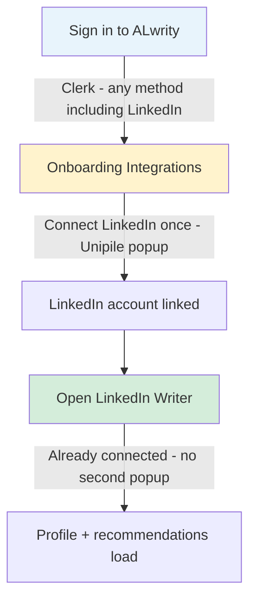

# LinkedIn Connection Flow — Revised Plan (Simpler End-User Experience)

**Date:** 2026-06-20 (revised)  
**Scope:** LinkedIn platform connection for LinkedIn Writer & onboarding  
**Constraint:** No code changes in this document — product, env, and process only  

---

## 1. Executive Summary

Two separate problems were mixed together:

| Problem | What it is |
|---------|------------|
| **A. Broken callback (your bug)** | Stale/mixed ngrok URLs in `.env` → popup shows ngrok offline error after OTP |
| **B. Over-complicated UX (product)** | End users see multiple “LinkedIn” steps that look the same but do different things |

**Good news:** Onboarding and LinkedIn Writer **already share the same connection code** (`useLinkedInSocialConnection` → Unipile Hosted Auth popup). You do **not** need a second integration path.

**Bad news:** The **Clerk “Sign in with LinkedIn”** button on the ALwrity login screen is **not** the same thing. It cannot replace Unipile platform connection.

**Revised strategy:**

1. Fix `.env` so one live ngrok URL is used everywhere (ops — no code).
2. Connect LinkedIn **once** during onboarding Integrations step.
3. LinkedIn Writer should **only check** existing connection — no second connect flow for users who already connected.
4. Keep Clerk LinkedIn for **app login only**; do not expose Unipile popup to users twice.

---

## 2. Two Different “LinkedIn” Flows (Do Not Merge)

End users currently see LinkedIn in two places. This is the main source of confusion.

### 2.1 Clerk LinkedIn — “Sign in to ALwrity”

**Where:** Login / sign-up modal (`localhost:3000` landing page)  
**Purpose:** Authenticate the **ALwrity user** (who you are in the app)  
**Provider:** Clerk OAuth  
**Grants:** Clerk session + JWT for ALwrity API calls  
**Does NOT grant:** Ability to post to LinkedIn, read LinkedIn profile via Unipile, or run LinkedIn analytics  

```
User → Clerk LinkedIn OAuth → ALwrity session ✅
                              → LinkedIn publishing ❌
```

### 2.2 Unipile Hosted Auth — “Connect LinkedIn account”

**Where:** Onboarding → Integrations → LinkedIn card **and** LinkedIn Writer → Connect LinkedIn  
**Purpose:** Link the user’s **LinkedIn professional account** to ALwrity for publishing, profile intelligence, analytics  
**Provider:** Unipile Hosted Auth Wizard ([Unipile docs](https://developer.unipile.com/docs/hosted-auth))  
**Grants:** Unipile `account_id` stored in per-user DB → backend calls LinkedIn APIs via Unipile  
**Requires:** Public callback URL (ngrok or deployed backend) for redirect + webhook  

```
User → Unipile popup (email/password/OTP) → ALwrity stores unipile_account_id ✅
                                            → LinkedIn Writer features work ✅
```

### 2.3 Can we reuse Clerk LinkedIn for LinkedIn Writer?

**No — not without major new architecture.**

| | Clerk LinkedIn login | Unipile platform connection |
|--|---------------------|----------------------------|
| Token owner | Clerk | Unipile (tokens server-side) |
| LinkedIn scopes | Basic OpenID profile (Clerk config) | Full LinkedIn access for posting/analytics |
| ALwrity backend use | User identity only | Profile fetch, posts, recommendations |
| Unipile requirement | Not involved | Required when `LINKEDIN_PROVIDER=unipile` |

Clerk proves *you are logged into ALwrity*. Unipile proves *ALwrity may act on your LinkedIn account*. Both are needed; neither replaces the other.

### 2.4 What we CAN reuse (already built)

Onboarding `LinkedInPlatformCard` and LinkedIn Writer `LinkedInConnectionPlaceholder` both call:

- `useLinkedInSocialConnection()` → `connectWithLinkedInOAuth()` → same backend `/api/linkedin-social/auth/url`

**There is already one platform-connection implementation.** The fix is **when** we ask the user to connect, not **how**.

---

## 3. Simpler End-User Journey (Recommended)

### Target experience



| Step | User action | System |
|------|-------------|--------|
| 1 | Sign in (Google, email, or Clerk LinkedIn) | Clerk session created |
| 2 | Onboarding → Connect LinkedIn (Integrations step) | Unipile popup once |
| 3 | Open LinkedIn Writer later | `GET /connection/status` → already connected, skip connect UI |
| 4 | If disconnected / expired | Show reconnect (same Unipile flow, with `reconnect` type per Unipile docs) |

### What to stop doing (product guidance)

- Do **not** ask users to “Connect LinkedIn” again in LinkedIn Writer if onboarding already succeeded.
- Do **not** label Clerk login as “connecting LinkedIn for publishing” — it is only app sign-in.
- Do **not** expect users to understand ngrok, popup postMessage, or refresh-to-fix — that is developer infrastructure.

### What users should see on success

1. Unipile popup closes automatically (or shows “Connection Successful” then closes).
2. Onboarding LinkedIn card shows **Connected**.
3. LinkedIn Writer opens directly to profile setup — **no second Connect button**.

---

## 4. Root Cause of Your Bug (Updated After Env Review)

### 4.1 Original failure

Popup redirected to **offline** ngrok host:

```
ERR_NGROK_3200 — littery-sonny-unscrutinisingly.ngrok-free.dev is offline
```

Unipile auth (email/password/OTP) **succeeded**. Callback redirect **failed**. Frontend showed false error; refresh recovered via `try_sync_unipile_accounts()`.

### 4.2 Current env review (2026-06-20)

**Live ngrok tunnel** (from your ngrok status UI at `127.0.0.1:4040/status`):

| Setting | Value |
|---------|-------|
| Public URL | `https://d28b-103-156-121-104.ngrok-free.app` |
| Forwards to | `http://localhost:8000` |
| Status | online |

**`.env` conflicts found** (duplicate keys — behavior depends on which value wins at load time):

| Variable | File | Hostname found |
|----------|------|----------------|
| `NGROK_URL` | backend | `littery-sonny-unscrutinisingly.ngrok-free.dev` **and** `d28b-103-156-121-104.ngrok-free.app` |
| `FRONTEND_URL` | backend | `littery-sonny-unscrutinisingly.ngrok-free.dev` **and** `localhost` |
| `BACKEND_URL` | backend | `d28b-103-156-121-104.ngrok-free.app` |
| `LINKEDIN_SOCIAL_REDIRECT_URI` | backend | `d28b-103-156-121-104.ngrok-free.app` ✅ |
| `REACT_APP_NGROK_ORIGIN` | frontend | `littery-sonny-unscrutinisingly.ngrok-free.dev` ❌ stale |

**Risk:** If backend resolves `NGROK_URL` to the **first** (stale) entry, Unipile still embeds the dead redirect URL even though you updated other vars. Frontend trusted-origin for postMessage may also reject messages if origins mismatch.

### 4.3 Why refresh showed “Connected”

Recovery path (no user action needed):

1. Unipile created the LinkedIn account link successfully.
2. On `GET /connection/status`, `try_sync_unipile_accounts()` finds the account by `name` (= ALwrity user id) and stores credentials.
3. UI shows Connected — but popup flow already told the user they failed.

---

## 5. Fix Plan (No Code — Env & Process Only)

### Phase 1 — Clean `.env` (do this now)

**Rule:** One live ngrok hostname everywhere. Remove duplicate lines. No stale `.ngrok-free.dev` entries unless that tunnel is actually running.

#### backend `.env` — keep exactly one value per key

```env
LINKEDIN_PROVIDER=unipile
UNIPILE_API_KEY=<your-key>
UNIPILE_DSN=api30.unipile.com:16037

# Single public URL — must match ngrok status page RIGHT NOW
NGROK_URL=https://d28b-103-156-121-104.ngrok-free.app
BACKEND_URL=https://d28b-103-156-121-104.ngrok-free.app
LINKEDIN_SOCIAL_REDIRECT_URI=https://d28b-103-156-121-104.ngrok-free.app/api/linkedin-social/callback

# Frontend origin for postMessage (local dev)
FRONTEND_URL=http://localhost:3000
OAUTH_CALLBACK_ALLOWED_ORIGINS=http://localhost:3000
```

**Remove** duplicate `NGROK_URL`, `FRONTEND_URL`, and any reference to `littery-sonny-unscrutinisingly.ngrok-free.dev`.

#### frontend `.env`

```env
FRONTEND_URL=http://localhost:3000
OAUTH_CALLBACK_ALLOWED_ORIGINS=http://localhost:3000

# Must match live ngrok OR be removed if unused
REACT_APP_NGROK_ORIGIN=https://d28b-103-156-121-104.ngrok-free.app

# Local dev: API stays on localhost (recommended)
REACT_APP_API_BASE_URL=http://localhost:8000
# REACT_APP_API_URL should stay commented unless you intentionally route all API via ngrok
```

#### After editing

1. Restart backend (uvicorn) — env is read at startup.
2. Restart frontend (`npm start`) — React env vars load at build/start.
3. Restart ngrok if subdomain changed (`ngrok http 8000` → update all URLs again).

---

### Phase 2 — Verify tunnel before every connect test

| Check | Expected |
|-------|----------|
| Ngrok status `127.0.0.1:4040/status` | Tunnel **online**, URL matches `.env` |
| Browser: `https://d28b-103-156-121-104.ngrok-free.app/docs` | FastAPI docs load (proves tunnel → backend) |
| Backend log on “Connect LinkedIn” | `[LinkedInConnect] Unipile redirect base_url=https://d28b-103-156-121-104.ngrok-free.app` |
| No reference in logs to `littery-sonny` | Old hostname gone |

---

### Phase 3 — Single connect point for end users

**Recommended test path:**

1. Sign in via Clerk (any method — LinkedIn login here is fine for app auth only).
2. Go to **Onboarding → Integrations → LinkedIn** → Connect once.
3. Complete Unipile popup (email/password/OTP).
4. Confirm onboarding card shows Connected **without refresh**.
5. Navigate to **LinkedIn Writer** → should show Connected / profile panel — **not** another Connect LinkedIn prompt.

If step 5 still shows Connect, the DB may not have credentials yet — retry Phase 1 env cleanup and disconnect/reconnect from onboarding only.

**Do not** test by connecting separately in LinkedIn Writer during onboarding validation — that duplicates the user journey you want to eliminate.

---

### Phase 4 — Unipile alignment (per official docs)

From [Unipile Hosted Auth](https://developer.unipile.com/docs/hosted-auth) and [Connect Accounts](https://developer.unipile.com/docs/connect-accounts):

| Unipile recommendation | ALwrity today | Simpler alignment |
|--------------------------|---------------|-------------------|
| Generate link server-side | ✅ `/auth/url` | Keep |
| Store `account_id` + internal `user_id` on notify | ✅ webhook + callback | Prefer **notify_url** as source of truth (works even if browser redirect hiccups) |
| One connect button in product | ⚠️ Two UIs (onboarding + writer) | **One** connect moment (onboarding) |
| Reconnect on CREDENTIALS status | Partial | Show reconnect only when status says disconnected |
| Do not iframe hosted auth | ✅ popup | Keep popup |
| Regenerate link each connect click | ✅ new link per request | Keep |

**notify_url** (`/api/unipile/webhook`) is the server-to-server path Unipile recommends when browser redirect fails. With a live ngrok URL, both redirect and webhook should work — but webhook is the reliable backbone for “connect once, store credentials.”

---

## 6. What Still Feels Hard for Users (Honest Assessment)

Even with perfect ngrok config, Unipile Hosted Auth requires:

- Popup window
- LinkedIn credentials + possible OTP / in-app validation ([LinkedIn checkpoints](https://developer.unipile.com/docs/linkedin))
- Developer dependency on public URL in local dev

**This cannot be reduced to a single Clerk button** without switching away from Unipile (e.g. native LinkedIn OAuth with different scopes, or custom auth — more engineering, not simpler for v1).

**What we can simplify without code (process/UX copy):**

| Current | Simpler messaging |
|---------|-------------------|
| “Connect LinkedIn” in Writer + onboarding | “Connect once in Integrations — Writer uses it automatically” |
| Clerk LinkedIn on login | Label: “Sign in with LinkedIn” (not “Connect for publishing”) |
| Error: “closed before completing” | Internal note: check ngrok first; user message should say “try again” only after env verified |
| Refresh to see Connected | Treat as bug symptom until env fixed — not acceptable final UX |

---

## 7. Future Improvements (Document Only — Not in Scope Now)

When you allow code changes later, prioritize **user simplicity** over infrastructure:

| Priority | Change | User benefit |
|----------|--------|--------------|
| P0 | Dedupe connect UI — Writer skips connect if onboarding connected | One connect, not two |
| P0 | On popup close, poll `/connection/status` before showing error | No false failure when Unipile already linked |
| P1 | Rely on webhook + status poll instead of postMessage-only success | Popup redirect less critical |
| P1 | Clear copy separating Clerk login vs platform connect | Less confusion |
| P2 | Stable staging URL instead of rotating ngrok free tier | Dev/prod parity |
| P3 | Unipile `reconnect` flow when CREDENTIALS webhook fires | Seamless re-auth |

**Do not pursue:** Using Clerk LinkedIn token as Unipile/LinkedIn API credential — different products, different tokens, not supported today.

---

## 8. Verification Checklist (After Env Cleanup)

### Infrastructure

- [ ] Only one `NGROK_URL` in backend `.env` — matches ngrok status page
- [ ] No stale `littery-sonny-unscrutinisingly.ngrok-free.dev` anywhere
- [ ] `REACT_APP_NGROK_ORIGIN` updated or removed
- [ ] Backend restarted after `.env` edit

### End-user flow (onboarding-first)

- [ ] Sign in via Clerk
- [ ] Connect LinkedIn **only** from onboarding Integrations
- [ ] Unipile popup completes → auto-close or success page
- [ ] Onboarding shows Connected without manual refresh
- [ ] LinkedIn Writer opens already connected (no second popup)
- [ ] Profile panel loads (separate issue if stuck on “Loading profile…”)

### Logs (success)

```
[LinkedInConnect] Unipile redirect base_url=https://d28b-103-156-121-104.ngrok-free.app
[LinkedInConnect] Unipile callback succeeded user_id=...
[LinkedInConnect] OAuth popup success message received
[LinkedInConnect] status loaded { connected: true, provider: 'unipile' }
```

---

## 9. Key Files Reference (Unchanged Architecture)

| Purpose | Path |
|---------|------|
| Shared connection hook (onboarding + writer) | `frontend/src/hooks/useLinkedInSocialConnection.ts` |
| Onboarding LinkedIn card | `frontend/src/components/OnboardingWizard/common/LinkedInPlatformCard.tsx` |
| Writer connect UI | `frontend/src/components/LinkedInWriter/components/LinkedInConnectionPlaceholder.tsx` |
| OAuth popup | `frontend/src/utils/linkedInOAuthConnect.ts` |
| Auth URL + callback | `backend/api/linkedin_social_routes.py` |
| Redirect URL building | `backend/services/integrations/linkedin_oauth.py` |
| Webhook (notify_url) | `backend/api/unipile_webhook_routes.py` |

---

## 10. Conclusion

**Your ngrok update is partially correct** — `LINKEDIN_SOCIAL_REDIRECT_URI` and one `NGROK_URL` point to the live `d28b-103-156-121-104.ngrok-free.app` tunnel. **Stale duplicate entries** (old `littery-sonny…` hostname in backend and `REACT_APP_NGROK_ORIGIN`) can still break redirects and postMessage.

**Clerk LinkedIn login cannot replace Unipile** — but **onboarding LinkedIn card already reuses the same Unipile flow** as LinkedIn Writer. The simpler product path is:

1. Fix `.env` duplicates today.  
2. Connect LinkedIn once in onboarding.  
3. LinkedIn Writer consumes that connection — no second connect for end users.  
4. Keep Clerk LinkedIn strictly for signing into ALwrity.

That reduces end-user complexity without any code changes — only env hygiene and where you ask users to connect.
