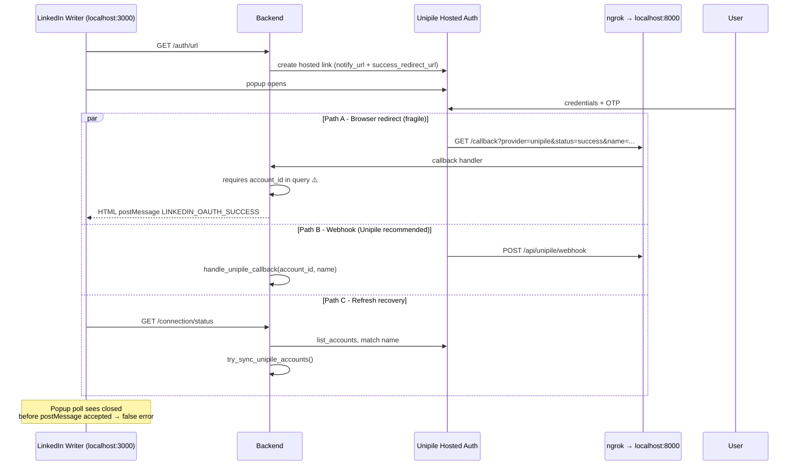

# LinkedIn Writer — Connect Flow Fix Plan

**Date:** 2026-06-20  
**Scope:** LinkedIn Writer only (`Connect LinkedIn` button → personal profile via Unipile)  
**Out of scope:** Onboarding connection flow (no changes)  
**Constraint:** This document is planning only — implementation tracked separately  

**Related:** [LINKEDIN_CONNECTION_FLOW_ISSUE_AND_FIX_PLAN.md](./LINKEDIN_CONNECTION_FLOW_ISSUE_AND_FIX_PLAN.md)

---

## 1. Current Symptom (After Ngrok Fix)

| Step | What happens |
|------|----------------|
| 1 | User clicks **Connect LinkedIn** in LinkedIn Writer |
| 2 | Unipile popup opens; user enters email, password, OTP |
| 3 | Popup **closes** (improvement vs before — redirect likely works now) |
| 4 | Main UI still shows: *LinkedIn connection was closed before completing. Please try again.* |
| 5 | Console: `[LinkedInConnect] OAuth popup closed before completion` — **no** `OAuth popup success message received` |
| 6 | Console: `linkedin-writer:1 Failed to load resource: 404` (minor — see §6) |
| 7 | **Page refresh** → shows **Connected** |
| 8 | Content suggestions error: *We couldn't load content suggestions right now. Please try again.* |

**Interpretation:** Unipile LinkedIn auth is **succeeding**. The failure is in ALwrity’s **handshake back to the parent window**, not in LinkedIn login itself.

---

## 2. Unipile Model vs ALwrity Implementation

### 2.1 What Unipile recommends ([Hosted Auth](https://developer.unipile.com/docs/hosted-auth))

Unipile Hosted Auth has **two success channels**:

| Channel | Purpose | Payload |
|---------|---------|---------|
| **`notify_url` webhook** (server-to-server) | **Primary** — store `account_id` + internal `name` (user id) | `{ "status": "CREATION_SUCCESS", "account_id": "...", "name": "user_xxx" }` |
| **`success_redirect_url`** (browser) | UX — redirect user’s browser after auth | Query params vary; not documented as always including `account_id` |

Unipile explicitly states: *"When your user successfully connects an account, you can receive a callback on a URL of your choice with the account_id and your internal ID"* — referring to **`notify_url`**, not the browser redirect.

### 2.2 LinkedIn checkpoints ([LinkedIn Guide](https://developer.unipile.com/docs/linkedin))

When using **Custom Auth** (your own forms), Unipile returns checkpoints (`OTP`, `2FA`, `IN_APP_VALIDATION`, etc.) and you solve them via API.

ALwrity uses **Hosted Auth Wizard** instead — Unipile’s hosted page handles OTP/checkpoints inside the popup. That matches Unipile’s recommendation for new integrations. **No change needed to auth method.**

### 2.3 What ALwrity does today



**Gap:** LinkedIn Writer treats **Path A postMessage** as the only success signal. Paths B and C can succeed silently while the UI reports failure.

---

## 3. Root Cause Analysis (Ranked)

### RC-1 — postMessage origin mismatch (**most likely cause of current error**)

**How it works:**

1. After OTP, browser loads callback at **`https://<ngrok-host>/api/linkedin-social/callback`**
2. Callback HTML runs `postMessage(payload, "http://localhost:3000")` toward the opener
3. Parent window receives message; **`event.origin`** = ngrok host (e.g. `https://d28b-103-156-121-104.ngrok-free.app`)
4. `linkedInOAuthConnect.ts` only accepts messages from **trusted origins**:

```13:22:frontend/src/utils/linkedInOAuthConnect.ts
export function getTrustedLinkedInOAuthOrigins(): string[] {
  const origins = getWixTrustedOrigins();
  try {
    const apiUrl = getApiBaseUrl();
    const parsed = new URL(apiUrl);
    origins.push(`${parsed.protocol}//${parsed.host}`);
  } catch {
    // ignore invalid API URL
  }
  return [...new Set(origins)];
}
```

Trusted list on localhost dev:

| Origin | In list? |
|--------|----------|
| `http://localhost:3000` | ✅ (window.location) |
| `http://localhost:8000` | ✅ (REACT_APP_API_BASE_URL) |
| `https://d28b-103-156-121-104.ngrok-free.app` | ❌ **missing** |
| `https://littery-sonny-unscrutinisingly.ngrok-free.dev` | ⚠️ stale entry in `REACT_APP_NGROK_ORIGIN` |

5. Message is **silently ignored** (`console.debug` only — easy to miss)
6. Popup calls `window.close()` → poll detects closed → **false error**

**Env evidence (2026-06-20):**

```
REACT_APP_NGROK_ORIGIN → littery-sonny-unscrutinisingly.ngrok-free.dev  ❌ wrong tunnel
NGROK_URL              → d28b-103-156-121-104.ngrok-free.app             ✅ live tunnel
```

**Why popup closes but UI fails:** Callback page loaded and closed; postMessage was rejected by origin filter.

---

### RC-2 — Browser callback may lack `account_id` (Unipile design mismatch)

ALwrity success redirect is built as:

```
/callback?provider=unipile&status=success&name={user_id}
```

Callback handler **requires** `account_id` in query:

```997:1000:backend/api/linkedin_social_routes.py
            if not resolved_account_id:
                logger.error(f"[LinkedInConnect] Unipile callback missing account_id user_id={user_id}")
                raise HTTPException(status_code=400, detail="Missing account_id from Unipile callback")
```

Per [Unipile Hosted Auth Step 4](https://developer.unipile.com/docs/hosted-auth), **`account_id` is delivered via `notify_url` webhook**, not guaranteed on browser redirect.

If Unipile redirect omits `account_id`:

- Browser callback returns **HTTP 400 JSON** (not success HTML)
- No `LINKEDIN_OAUTH_SUCCESS` postMessage
- Webhook (`/api/unipile/webhook`) or refresh sync (`try_sync_unipile_accounts`) still stores credentials → **refresh shows Connected**

**Check backend logs for:** `[LinkedInConnect] Unipile callback missing account_id`

---

### RC-3 — Success depends on popup postMessage only (architecture gap)

`connectWithLinkedInOAuth()` resolves **only** on `LINKEDIN_OAUTH_SUCCESS` postMessage. It does **not**:

- Poll `GET /connection/status` while popup is open
- Wait for webhook completion
- On popup close, verify connection before rejecting

Unipile’s recommended flow stores credentials from **`notify_url`**. ALwrity should not treat browser redirect as the sole source of truth.

---

### RC-4 — Env duplicates still present

Backend `.env` still has duplicate keys (last value wins — fragile):

| Key | Values found |
|-----|--------------|
| `FRONTEND_URL` | stale ngrok **and** `localhost` |
| `NGROK_URL` | live `.app` tunnel ✅ |

Frontend stale `REACT_APP_NGROK_ORIGIN` directly causes RC-1.

---

### RC-5 — Content suggestions error (separate, post-connect)

After refresh shows Connected, profile pipeline runs. Recommendations error comes from Phase 6 logic:

```
"We couldn't load content suggestions right now. Please try again."
```

Triggered when `get_or_generate_topic_recommendations()` fails (LLM, validation, or incomplete profile intelligence). **Not caused by OAuth popup handshake** — debug after connect handshake is fixed.

---

## 4. Fix Plan

### Phase 0 — Immediate env fix (no code, test first)

**Goal:** Fix RC-1 by aligning frontend trusted origin with live ngrok.

#### frontend `.env`

```env
# Must match LIVE ngrok tunnel from 127.0.0.1:4040/status
REACT_APP_NGROK_ORIGIN=https://d28b-103-156-121-104.ngrok-free.app

REACT_APP_API_BASE_URL=http://localhost:8000
FRONTEND_URL=http://localhost:3000
```

Remove or update any `littery-sonny-unscrutinisingly.ngrok-free.dev` reference.

#### backend `.env`

Keep **one value per key** only:

```env
NGROK_URL=https://d28b-103-156-121-104.ngrok-free.app
BACKEND_URL=https://d28b-103-156-121-104.ngrok-free.app
LINKEDIN_SOCIAL_REDIRECT_URI=https://d28b-103-156-121-104.ngrok-free.app/api/linkedin-social/callback

FRONTEND_URL=http://localhost:3000
OAUTH_CALLBACK_ALLOWED_ORIGINS=http://localhost:3000
```

Delete duplicate/stale `FRONTEND_URL` and `NGROK_URL` lines.

#### Restart

1. Restart frontend (`npm start`) — React env loads at start  
2. Restart backend  
3. Keep ngrok running on port 8000  

#### Verify before connect

Open browser DevTools → Console → enable **Verbose** logging.

On connect, you should **not** see:

```
[LinkedInConnect] ignored postMessage from untrusted origin { origin: "https://d28b-..." }
```

You **should** see:

```
[LinkedInConnect] OAuth popup success message received
[LinkedInConnect] OAuth connect succeeded
```

Also check ngrok inspector (`http://127.0.0.1:4040`) for:

| Request | Expected |
|---------|----------|
| `GET .../callback?provider=unipile&...` | 200 HTML (not 400 JSON) |
| `POST .../api/unipile/webhook` | 200 |

---

### Phase 1 — LinkedIn Writer code fixes (required even if Phase 0 helps)

**Scope:** `linkedInOAuthConnect.ts`, `useLinkedInSocialConnection.ts` only. **Do not touch onboarding.**

| ID | Fix | Addresses | Priority |
|----|-----|-----------|----------|
| **F1** | Add live public backend origin to trusted list automatically (derive from auth URL or `REACT_APP_NGROK_ORIGIN` matching `NGROK_URL`) | RC-1 | P0 |
| **F2** | On popup close, call `GET /connection/status` **before** rejecting; if `connected: true`, resolve as success | RC-3 | P0 |
| **F3** | While popup open, poll `/connection/status` every 2s as fallback to webhook completion | RC-3 | P1 |
| **F4** | Promote ignored postMessage log from `debug` to `warn` with origin details | RC-1 | P1 |
| **F5** | Backend: if browser callback has `status=success` but no `account_id`, return success HTML anyway and rely on webhook/sync (or fetch account by `name` from Unipile API) | RC-2 | P1 |
| **F6** | Backend: never return raw HTTP 400 JSON on Unipile callback — always return HTML with `LINKEDIN_OAUTH_ERROR` postMessage | RC-2 UX | P2 |

**Recommended success logic for LinkedIn Writer (target behavior):**

```
Success if ANY of:
  1. postMessage LINKEDIN_OAUTH_SUCCESS received
  2. GET /connection/status returns connected: true (poll or on popup close)
  3. CustomEvent linkedin-oauth-success from another tab (existing)
```

This aligns with [Unipile’s notify_url-first design](https://developer.unipile.com/docs/hosted-auth).

---

### Phase 2 — Content suggestions (after connect works)

| Step | Action |
|------|--------|
| 1 | Confirm `GET /api/linkedin-social/profile` completes after connect |
| 2 | Check backend logs for `[TopicRecommendation]` errors (LLM, validation, missing intelligence) |
| 3 | Ensure profile intelligence pipeline finished before recommendations |
| 4 | Retry with `refresh_recommendations=true` query param if supported |

User-facing error is generic by design — backend logs hold the real cause.

---

## 5. Diagnostic Checklist (Run During Next Test)

### Before clicking Connect

- [ ] Ngrok status page shows tunnel **online**
- [ ] `REACT_APP_NGROK_ORIGIN` host = ngrok status host
- [ ] No stale ngrok hostnames in any `.env`
- [ ] Backend + frontend restarted after env edit

### During connect

- [ ] Console: `auth URL fetched { provider: 'unipile' }`
- [ ] Console: `OAuth popup opened`
- [ ] Ngrok inspector: callback `GET` appears
- [ ] Ngrok inspector: webhook `POST /api/unipile/webhook` appears

### Success criteria

- [ ] Console: `OAuth popup success message received` **OR** status poll shows connected before error
- [ ] UI shows Connected **without manual refresh**
- [ ] Backend log: `Unipile callback succeeded` **OR** `UnipileWebhook Credential storage stored=True`

### If still failing

| Log / signal | Meaning | Action |
|--------------|---------|--------|
| `ignored postMessage from untrusted origin` | RC-1 | Fix `REACT_APP_NGROK_ORIGIN` or implement F1 |
| `Unipile callback missing account_id` | RC-2 | Implement F5; verify webhook fires |
| No callback in ngrok inspector | Redirect URL wrong | Fix `NGROK_URL`, regenerate auth link |
| No webhook in ngrok inspector | notify_url unreachable | Same as above |
| Connected on refresh only | RC-3 | Implement F2/F3 |
| Recommendations error after connected | RC-5 | Phase 2 — check profile/LLM logs |

---

## 6. Minor: `linkedin-writer:1` 404

The console entry `linkedin-writer:1 Failed to load resource: 404` refers to the **page URL** (`/linkedin-writer`), not the OAuth API. Usually a missing favicon, manifest, or service-worker asset. **Not blocking connect.** Ignore unless other 404s appear on `/api/linkedin-social/*`.

---

## 7. Unipile Docs — What We Should / Should Not Do

| Unipile guidance | ALwrity status | Action |
|------------------|----------------|--------|
| Use Hosted Auth for new integrations | ✅ Using hosted wizard | Keep |
| Do not iframe hosted auth | ✅ Using popup | Keep |
| Store account via `notify_url` + `name` | ✅ Webhook implemented | Make Writer UI trust webhook path (F2/F3) |
| Regenerate link each connect click | ✅ New link per `/auth/url` | Keep |
| Custom Auth for own OTP forms | ❌ Not needed | Do not switch unless product requires in-app forms |
| Handle checkpoints via API | N/A for Hosted Auth | Unipile handles in popup |
| Account status webhook for reconnect | Partial | Future: reconnect on CREDENTIALS status |

---

## 8. Files to Change (Implementation Reference)

| Phase | File | Change |
|-------|------|--------|
| 0 | `frontend/.env`, `backend/.env` | Align ngrok URLs, remove duplicates |
| 1 | `frontend/src/utils/linkedInOAuthConnect.ts` | F1, F2, F3, F4 |
| 1 | `frontend/src/hooks/useLinkedInSocialConnection.ts` | Optional: pass `checkStatus` into OAuth helper for F2 |
| 1 | `backend/api/linkedin_social_routes.py` | F5, F6 (callback route only) |
| 1 | `backend/services/integrations/linkedin_oauth.py` | Optional: helper to resolve account by `name` when redirect lacks id |
| — | Onboarding files | **No changes** |

---

## 9. Expected Outcome

After Phase 0 (env) + Phase 1 (code):

1. User clicks **Connect LinkedIn** in LinkedIn Writer  
2. Completes Unipile popup (email / password / OTP)  
3. Popup closes; main window shows **Connected** immediately  
4. Profile setup panel loads without refresh  
5. Content suggestions may still need Phase 2 if profile intelligence is incomplete  

---

## 10. Summary

| Question | Answer |
|----------|--------|
| Is LinkedIn login failing? | **No** — Unipile auth completes |
| Is ngrok fully fixed? | **Partially** — live tunnel works (popup closes), but frontend still trusts **wrong** ngrok origin |
| Why refresh shows Connected? | Webhook and/or `try_sync_unipile_accounts()` stores credentials despite UI error |
| Why recommendations fail? | Separate Phase 6 pipeline issue after connect |
| Fastest test without code? | Set `REACT_APP_NGROK_ORIGIN` to live ngrok URL, restart frontend, retry |
| Proper fix for LinkedIn Writer? | Phase 0 env + Phase 1 F1/F2 (trust postMessage origin + poll status on popup close) |

**Next step for you:** Apply Phase 0 env changes, retry connect with DevTools verbose on, and check ngrok inspector for callback + webhook requests. If postMessage is still ignored, proceed with Phase 1 implementation in LinkedIn Writer files only.
