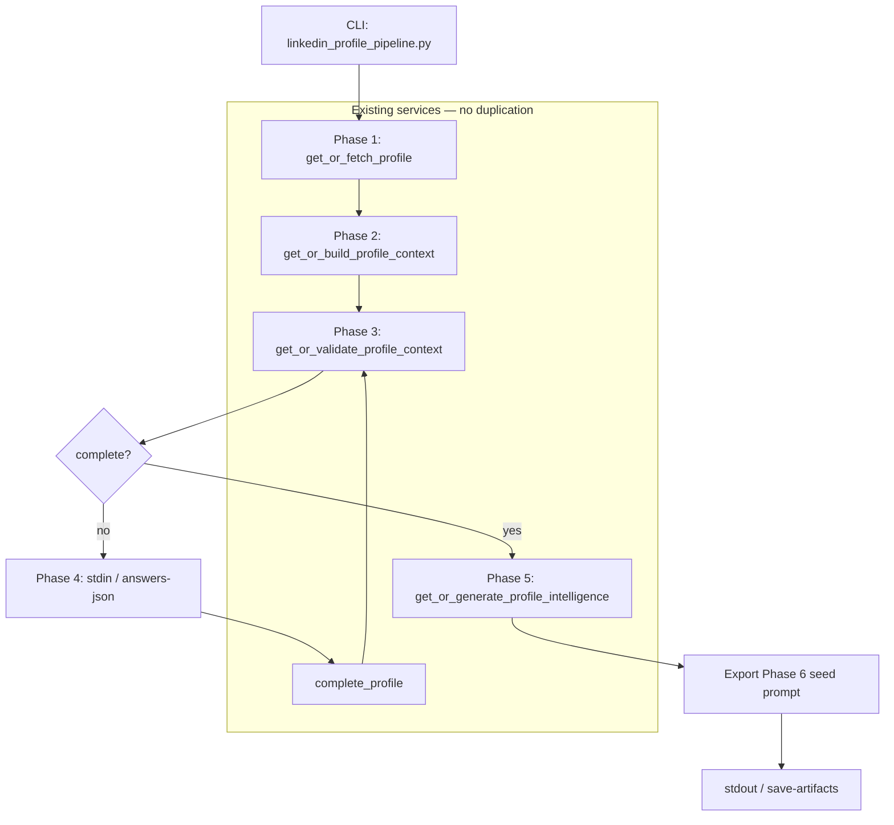

# ALwrity LinkedIn Writer
# Phase 1–5 CLI End-to-End Pipeline Plan

**Created:** 2026-06-19  
**Purpose:** Plan a single CLI command that runs the full LinkedIn profile pipeline (Acquire → Normalize → Validate → Complete → Understand) before Phase 6 is implemented.  
**Audience:** Cursor / backend implementer  
**Status:** Planning only — **no code in this document**

---

# Related Documents

| Phase | Doc |
|-------|-----|
| 1 Acquire | `docs/linkedin/linkedin-analysis-context/Phase 1 – Acquire Data.md` |
| 2 Normalize | `docs/linkedin/linkedin-analysis-context/Phase 2 → Normalize Data.md` |
| 3 Validate | `docs/linkedin/linkedin-analysis-context/Phase 3 → Validate Data.md` |
| 4 Complete | `docs/linkedin/linkedin-analysis-context/Phase 4 → Complete Data.md` |
| 5 Understand | `docs/linkedin/linkedin-analysis-context/Phase 5 → Understand Data.md` |
| 6 Topics *(not in scope)* | `docs/linkedin/linkedin-analysis-context/Phase 6 - Personalized Content Recommendation Engine.md` |

Existing partial CLI: `backend/scripts/linkedin_fetch_profile.py` (Phase 1 + optional Phase 2 only).

---

# Objective

Provide **one CLI command** that mirrors what happens after a user connects LinkedIn in ALwrity:

```
User connects LinkedIn (Unipile OAuth already done)
        ↓
Phase 1 — Fetch + normalize + persist profile
        ↓
Phase 2 — Build LinkedInProfileContext + persist
        ↓
Phase 3 — Validate completeness
        ↓
Phase 4 — If incomplete: ask missing-field questions in the terminal; patch context; re-validate (loop until complete)
        ↓
Phase 5 — Generate AI Profile Intelligence (Gemini) + persist
        ↓
CLI output — Validated intelligence JSON + Phase 6 seed prompt (LLM-ready profile summary input)
```

**This is an integration / manual QA tool**, not a replacement for `GET /api/linkedin-social/profile`. It must **reuse the same service layer** the API uses — no duplicate business logic.

---

# What Success Looks Like

After running one command, the operator sees:

1. Phase-by-phase progress summaries (like existing Phase 1/2 CLI output).
2. Interactive completion prompts when the profile is incomplete (Phase 4 parity with the web form).
3. AI Profile Intelligence when the profile becomes complete (Phase 5).
4. A **Phase 6 seed artifact**: compact JSON (or prompt file) containing validated `AIProfileIntelligence` — the exact input Phase 6 will send to the LLM for 5 topic recommendations.

Phase 6 itself (**5 personalized content topic recommendations**) is **explicitly out of scope** for this CLI.

---

# Current Gap

| Capability | `linkedin_fetch_profile.py` today | Target E2E CLI |
|------------|-----------------------------------|----------------|
| Phase 1 acquire | ✅ `--user-id`, `--refresh` | ✅ Reuse |
| Phase 2 context | ✅ `--print-context` | ✅ Always run (persist) |
| Phase 3 validate | ❌ | ✅ New step |
| Phase 4 complete | ❌ | ✅ Interactive terminal loop |
| Phase 5 intelligence | ❌ | ✅ New step (live Gemini) |
| Phase 6 seed export | ❌ | ✅ Print / save artifact |
| Offline fixture path | ✅ `--from-fixture` | ⚠️ Optional follow-up (Phases 3–5 without Unipile) |

The HTTP route `GET /api/linkedin-social/profile` already orchestrates Phases 1–5 **without** interactive completion. The new CLI closes the gap by adding **terminal-driven Phase 4** and **Phase 6 seed export**.

---

# Proposed CLI Surface

## Primary command (new script recommended)

Create a dedicated script to avoid overloading Phase 1 gates:

```
backend/scripts/linkedin_profile_pipeline.py
```

**Recommended invocation:**

```bash
cd backend
python scripts/linkedin_profile_pipeline.py --user-id <CLERK_USER_ID>
```

### Core flags

| Flag | Default | Purpose |
|------|---------|---------|
| `--user-id` | required | ALwrity user with LinkedIn connected (`unipile_account_id` in OAuth tokens) |
| `--refresh` | false | Force Phase 1 Unipile refetch (same as existing script) |
| `--refresh-intelligence` | false | Force Phase 5 LLM regeneration (bypass cache) |
| `--non-interactive` | false | Skip Phase 4 prompts; stop with exit code if incomplete |
| `--answers-json PATH` | — | Batch Phase 4 answers from file (CI / repeat runs) |
| `--print-json` | false | Dump full JSON payloads to stdout at end |
| `--save-artifacts DIR` | — | Write intelligence + Phase 6 seed files to disk |
| `--skip-llm` | false | Run Phases 1–4 only; useful when testing completion loop without Gemini quota |

### Optional parity flags (reuse from Phase 1 script)

| Flag | Purpose |
|------|---------|
| `--linkedin-sections` | Passed to Unipile step 2 (default `*`) |

### Exit codes

| Code | Meaning |
|------|---------|
| 0 | Pipeline complete; intelligence generated (or `--skip-llm` and profile complete) |
| 1 | Operational failure (Unipile, LLM, persistence, validation) |
| 2 | Usage / missing `--user-id` |
| 3 | Profile incomplete and `--non-interactive` (or user declined to answer) |

---

# End-to-End Flow (Service Calls)

Each step must call **existing orchestrators** — never re-implement rules inline.

```
┌─────────────────────────────────────────────────────────────────┐
│ STEP 1 — Phase 1: Acquire                                       │
│   get_or_fetch_profile(user_id, refresh=...)                    │
│   → normalized profile + meta (profile_content_hash)            │
│   Persist: normalized_profile_json (via service)                  │
└────────────────────────────┬────────────────────────────────────┘
                             ↓
┌─────────────────────────────────────────────────────────────────┐
│ STEP 2 — Phase 2: Normalize → Context                           │
│   get_or_build_profile_context(user_id, normalized, hash, repo) │
│   → LinkedInProfileContext + context meta                       │
│   Persist: profile_context_json                                   │
└────────────────────────────┬────────────────────────────────────┘
                             ↓
┌─────────────────────────────────────────────────────────────────┐
│ STEP 3 — Phase 3: Validate                                      │
│   get_or_validate_profile_context(user_id, context, repo)       │
│   → profile_validation (is_profile_complete, missing_fields, …) │
│   Persist: profile_validation_json                                │
└────────────────────────────┬────────────────────────────────────┘
                             ↓
                    is_profile_complete?
                    /              \
                  no                yes
                  ↓                  ↓
┌──────────────────────────┐   (skip to Step 5)
│ STEP 4 — Phase 4: Complete│
│   build_completion_questions(missing_fields)                    │
│   → prompt user in terminal (or read --answers-json)          │
│   complete_profile(user_id, answers, repo)                    │
│   → patched context + re-validation + remaining questions     │
│   Loop until complete OR max questions exhausted per submit   │
└──────────────────────────┬────────────────────────────────────┘
                           ↓
┌─────────────────────────────────────────────────────────────────┐
│ STEP 5 — Phase 5: Understand (skip if --skip-llm)               │
│   Gate: is_profile_complete === true                            │
│   get_or_generate_profile_intelligence(                         │
│       user_id, profile_context, profile_validation, repo,       │
│       force_regenerate=refresh_intelligence                     │
│   )                                                             │
│   → AIProfileIntelligence + meta (cache | generated)            │
│   Persist: ai_profile_intelligence_json                           │
└────────────────────────────┬────────────────────────────────────┘
                             ↓
┌─────────────────────────────────────────────────────────────────┐
│ STEP 6 — Export Phase 6 seed (no LLM call)                      │
│   build_phase6_seed_prompt(intelligence)  ← new thin helper     │
│   Print summary + optional --save-artifacts                     │
└─────────────────────────────────────────────────────────────────┘
```

### Services to reuse (do not duplicate)

| Phase | Module | Function |
|-------|--------|----------|
| 1 | `profile_service.py` | `get_or_fetch_profile` |
| 2 | `profile_context_service.py` | `get_or_build_profile_context` |
| 3 | `profile_validation_service.py` | `get_or_validate_profile_context` |
| 4 questions | `profile_completion_questions.py` | `build_completion_questions` |
| 4 submit | `profile_completion_service.py` | `complete_profile` |
| 5 | `profile_intelligence_service.py` | `get_or_generate_profile_intelligence` |
| Repo | `profile_repository.py` | `ProfileRepository` |

### What the CLI must NOT do

- Call Unipile outside Phase 1 acquire.
- Read `normalized_profile_json` to infer missing fields (Phase 4 uses validation only).
- Put business logic in the script — orchestration + I/O only.
- Implement Phase 6 topic LLM call.
- Raise `HTTPException` (CLI maps domain errors to exit codes + stderr).

---

# Phase 4 — Interactive CLI UX

Mirror the web `ProfileCompletionForm` behavior using the same question definitions.

## Loop algorithm

```text
validation = get_or_validate_profile_context(...)
while not validation.is_profile_complete:
    questions = build_completion_questions(validation.missing_fields)
    if not questions:
        break  # edge case — log and fail

    display completeness_score, missing_fields, up to 5 questions
    collect answers from stdin (or --answers-json)

    if user sends empty / quit:
        exit 3

    result = complete_profile(user_id, answers)
    validation = result.profile_validation

    if still incomplete and more questions remain:
        continue
```

## Input mapping by `input_type`

| `input_type` | CLI behavior |
|--------------|--------------|
| `text` | Single line stdin |
| `textarea` | Multi-line until blank line or `END` sentinel |
| `tags` | Comma-separated line → list of strings (same coercion as API body) |

## Batch mode (`--answers-json`)

File shape (field keys match Phase 4 allowed keys):

```json
{
  "about": "I build scalable backend systems...",
  "industry": "Software Development",
  "skills": ["Python", "FastAPI", "System Design"]
}
```

Script applies answers in one or more `complete_profile` calls until complete or failure — useful for repeatable QA without typing.

## `--non-interactive`

If `is_profile_complete === false`:

- Print validation summary + questions that *would* be asked.
- Exit `3` without calling `complete_profile`.
- Do not run Phase 5.

---

# Phase 5 — Understand + Output

When profile is complete, call `get_or_generate_profile_intelligence` exactly as `GET /profile` does.

## CLI summary block (stdout)

Print human-readable sections:

```
============================================================
LinkedIn Profile Pipeline — Phase 5 AI Intelligence Summary
============================================================
source:                  generated | cache
context_hash:            <sha256 prefix>
professional_identity:   ...
experience_level:        ...
industry:                ...
summary:                 <first 200 chars>...
primary_expertise:       Python, FastAPI, ...
writing_opportunities:   Backend Best Practices, ...
============================================================
```

Do **not** log full context or intelligence at INFO in services (existing rule). CLI may print full JSON only when `--print-json` is set.

## Error handling (CLI)

| Error | CLI behavior |
|-------|--------------|
| `ProfileIntelligenceLLMError` | stderr message + exit 1 (quota/auth/timeout) |
| `ProfileIntelligenceValidationError` | exit 1 after service retry exhausted |
| Profile incomplete at Phase 5 gate | should not happen if Step 4 loop correct; log bug + exit 1 |

---

# Phase 6 Seed Artifact (Pre-Phase-6 Deliverable)

Phase 6 will consume **only** `AIProfileIntelligence` — not `LinkedInProfileContext`.

The CLI must produce an **LLM-ready seed** the team can manually paste into Gemini (or future Phase 6 tests) **before** implementing Phase 6.

## New thin helper (implementation task)

Add to prompts layer (no business logic):

```
backend/prompts/linkedin/topic_recommendation_prompt.py   ← Phase 6 stub
```

Exports (minimal for now):

```python
PHASE6_TOPIC_SYSTEM_PROMPT_PLACEHOLDER: str   # short stub referencing Phase 6 doc
build_topic_recommendation_user_prompt(intelligence: dict) -> str
```

`build_topic_recommendation_user_prompt` = compact `json.dumps(intelligence, sort_keys=True)` — same pattern as Phase 5's `build_profile_intelligence_user_prompt`.

## CLI export modes

| Mode | Output |
|------|--------|
| stdout (default) | Phase 6 seed: system stub + user JSON block |
| `--save-artifacts DIR` | Files below |

### Artifact files (when `--save-artifacts`)

| File | Contents |
|------|----------|
| `ai_profile_intelligence.json` | Full validated intelligence (includes `meta`) |
| `phase6_user_prompt.txt` | User message for Phase 6 LLM |
| `phase6_system_prompt.txt` | Placeholder system prompt (Phase 6 doc reference) |
| `pipeline_summary.txt` | Human-readable run summary (phases, hashes, completeness) |

This gives operators a **ready-made Phase 6 input** without implementing topic generation.

---

# Relationship to Production API

| Concern | `GET /profile` | E2E CLI |
|---------|----------------|---------|
| Phase 1–3 | ✅ | ✅ Same services |
| Phase 4 | Returns questions JSON; user submits via `POST /profile/complete` | Terminal loop calling `complete_profile` directly |
| Phase 5 | Automatic when complete | Same `get_or_generate_profile_intelligence` |
| Phase 6 seed | Not exposed yet | **CLI-only export** |
| Auth | Clerk JWT | `--user-id` + DB OAuth tokens (same as `linkedin_fetch_profile.py`) |

The CLI is the **developer substitute** for: connect → load profile page → answer completion form → wait for intelligence → *(future)* see 5 topics.

---

# Implementation Roadmap for Cursor

Execute in order. Each step should be runnable before the next.

## Step 1 — Script skeleton + Phase 1–2

- Create `backend/scripts/linkedin_profile_pipeline.py`.
- Copy env bootstrap pattern from `linkedin_fetch_profile.py` (`dotenv`, `sys.path`, Loguru).
- Implement Steps 1–2 only; print existing-style summaries.
- **Verify:** same output as `linkedin_fetch_profile.py --user-id X --print-context`.

## Step 2 — Phase 3 validation step

- After context build, call `get_or_validate_profile_context`.
- Print validation summary: `is_profile_complete`, `completeness_score`, `missing_fields`.
- **Verify:** matches `GET /profile` validation for same user.

## Step 3 — Interactive Phase 4 loop

- Implement stdin question flow + `--answers-json` + `--non-interactive`.
- Call `complete_profile` per batch of answers; loop until complete.
- **Verify:** incomplete profile becomes complete; SQLite columns updated (`user_completion_json`, patched `profile_context_json`).

## Step 4 — Phase 5 intelligence

- On complete profile, call `get_or_generate_profile_intelligence`.
- Support `--refresh-intelligence` and `--skip-llm`.
- **Verify:** intelligence persisted; second run hits cache unless refresh.

## Step 5 — Phase 6 seed export

- Add `build_topic_recommendation_user_prompt` stub in prompts.
- Print seed + optional `--save-artifacts`.
- **Verify:** saved JSON validates against `AIProfileIntelligence` schema.

## Step 6 — Tests

| Test | Type | Scope |
|------|------|-------|
| Phase 4 loop with `--answers-json` | Integration (mock repo or test DB) | Completion → complete → intelligence gate opens |
| `--non-interactive` incomplete | Unit | Exit code 3 |
| `--skip-llm` | Integration | Phases 1–4 only, exit 0 when complete |
| Phase 6 seed builder | Unit | Prompt contains intelligence keys, no context leakage |

Mock LLM in pipeline tests (`generate_fn` injection) — **no network in CI**.

## Step 7 — Documentation touch-up

- Add "E2E CLI" section to Phase 5 doc (or link to this plan).
- Add usage example to `docs/linkedin/README` if one exists.

---

# Prerequisites

## Environment

- `backend/.env` loaded (same as existing scripts).
- Unipile: `UNIPILE_API_KEY`, `UNIPILE_DSN`.
- Gemini: credentials required for Phase 5 (unless `--skip-llm`).
- SQLite / DB with `linkedin_analysis_context` table.

## User setup

1. User has completed LinkedIn OAuth connect (Unipile account linked).
2. Operator knows ALwrity `user_id` (Clerk ID).
3. Optional: run with `--refresh` to simulate "Refresh from LinkedIn".

## Example session

```bash
cd backend

# Full pipeline (interactive)
python scripts/linkedin_profile_pipeline.py --user-id user_2abc123

# Force fresh LinkedIn data + regenerate intelligence
python scripts/linkedin_profile_pipeline.py --user-id user_2abc123 --refresh --refresh-intelligence

# Save Phase 6 seed files for manual topic prompt testing
python scripts/linkedin_profile_pipeline.py --user-id user_2abc123 --save-artifacts ./tmp/linkedin-run

# CI-style: predefined answers, no stdin
python scripts/linkedin_profile_pipeline.py --user-id user_2abc123 --answers-json ./fixtures/completion_answers.json
```

---

# Acceptance Criteria

The implementation is done when:

- [ ] One command runs Phases 1–5 sequentially for a connected user.
- [ ] All persistence goes through existing services/repository (no duplicate logic).
- [ ] Incomplete profiles prompt for missing fields in the terminal until complete (or exit 3 in non-interactive mode).
- [ ] Complete profiles produce validated `AIProfileIntelligence` (live Gemini or cache).
- [ ] CLI prints Phase 6 seed prompt (intelligence JSON as user message).
- [ ] `--save-artifacts` writes intelligence JSON + prompt files.
- [ ] `--skip-llm` stops after Phase 4 without calling Gemini.
- [ ] Second run uses caches (Phase 1 profile, Phase 5 intelligence) unless refresh flags set.
- [ ] Unit/integration tests cover completion loop and seed export (mocked LLM).
- [ ] Phase 6 topic recommendation is **not** implemented.

---

# Explicit Out of Scope

Do **not** implement in this CLI work:

- Phase 6 LLM topic recommendation call
- Frontend / React changes
- New HTTP endpoints
- OAuth / connect flow
- Content generation (posts, articles)
- Vector DB, analytics, competitor analysis
- Replacing or removing `linkedin_fetch_profile.py` (may cross-link in docstring)

---

# Open Questions (Resolve Before Coding)

| # | Question | Default if unanswered |
|---|----------|------------------------|
| 1 | New script vs extend `linkedin_fetch_profile.py`? | **New script** (`linkedin_profile_pipeline.py`) — clearer ownership |
| 2 | Fixture mode for Phases 3–5 offline? | Defer; Phase 1 script keeps fixture path |
| 3 | Max completion loops before abort? | Same as API — loop until complete or user quits |
| 4 | Include Phase 5 system/user prompts in artifacts? | Optional `--save-artifacts` file `phase5_prompts.txt` for debugging |

---

# Architecture Diagram



---

# Summary for Cursor

**Build one orchestration CLI** that chains existing Phase 1–5 services, adds **terminal-based Phase 4 completion**, runs **Phase 5 Gemini intelligence**, and exports a **Phase 6 LLM seed** from validated `AIProfileIntelligence`. Treat this as a manual QA path for the same pipeline the end user triggers after connecting LinkedIn — stop before Phase 6 topic recommendations.
