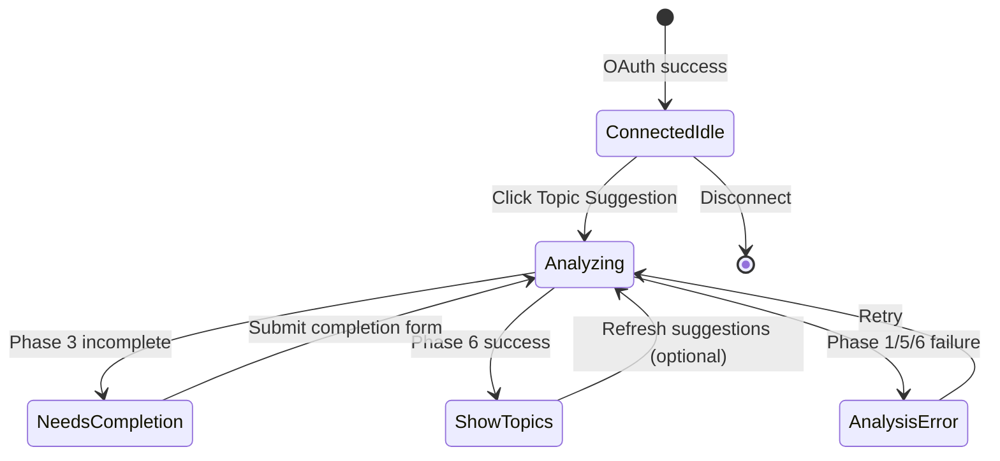

# LinkedIn Writer — Decoupled Topic Suggestion Plan

**Date:** 2026-06-20  
**Scope:** LinkedIn Writer only (Unipile connected users)  
**Goal:** Separate **Connect LinkedIn** from **LinkedIn Analysis Context (Phases 1–6)**; add explicit **Topic Suggestion** button  
**Constraint:** Planning document only — no code changes in this file  

**Related docs:**
- [Phase 6 – Personalized Content Recommendation Engine](./linkedin-analysis-context/Phase%206%20-%20Personalized%20Content%20Recommendation%20Engine.md)
- [LINKEDIN_WRITER_CONNECT_FIX_PLAN.md](./LINKEDIN_WRITER_CONNECT_FIX_PLAN.md)

---

## 1. Problem Statement

### What works today
- **Connect flow** is fixed — user connects LinkedIn personal profile via Unipile; UI shows **Connected**.

### What is broken / confusing
- Immediately after connect, UI shows **"We couldn't load content suggestions right now. Please try again."**
- Network tab does **not** show a clear Phase 1 → Phase 6 progression when the user connects.
- End users did not ask to run profile analysis at connect time — they only wanted to link their account.

### Root cause (architecture, not a single bug)

Today, **connection** and **analysis** are coupled in the UI:

```
Connect succeeds
  → LinkedInProfileSetupPanel mounts
    → useLinkedInProfileCompletion(true) runs on mount
      → GET /api/linkedin-social/profile (single bundled call)
        → Backend runs Phases 1–6 in one request
          → Phase 6 may fail → recommendations_error shown immediately
```

| Concern | Current behavior |
|---------|------------------|
| User intent at connect | "Link my LinkedIn account" |
| What the app does | Automatically fetches profile, validates, runs LLM intelligence + recommendations |
| Network visibility | One `GET /profile` call — not six separate phase requests |
| Retry button | Calls `GET /profile?refresh_recommendations=true` — **Phase 6 only**, skips re-fetch if earlier phases failed |
| Failure UX | User sees Connected **and** an error about suggestions — feels broken |

---

## 2. Target Experience

### After connect (no analysis yet)

```
┌─────────────────────────────────────────────┐
│  [Avatar]  Connected          [Disconnect]  │
└─────────────────────────────────────────────┘

┌─────────────────────────────────────────────┐
│  Personalized topic ideas for your LinkedIn │
│  profile                                    │
│                                             │
│  [ Topic Suggestion ]                       │
│                                             │
│  Analyze your profile to get five tailored  │
│  content ideas.                             │
└─────────────────────────────────────────────┘
```

- **No** automatic `GET /profile` on mount.
- **No** recommendations error until user has clicked **Topic Suggestion** at least once.
- Connection card unchanged.

### After clicking **Topic Suggestion**

1. Show progress: *"Analyzing your LinkedIn profile…"* (single calm loading state).
2. Backend runs **Phases 1 → 6** in order.
3. Outcomes:

| Outcome | UI |
|---------|-----|
| Profile incomplete (Phase 3/4) | Show **Profile Completion** questions first; after submit, continue Phases 5–6 |
| Profile complete | Show **What to write next** with 5 recommendation cards |
| Phase 6 LLM failure | Soft error + **Retry** (re-runs full pipeline or Phase 6 only — see §5) |
| Phase 1 Unipile failure | Clear error: *"Could not load your LinkedIn profile. Check connection and try again."* |

### Explicit separation

| Feature | Trigger | API / service |
|---------|---------|---------------|
| **Connect LinkedIn** | Connect button | `/auth/url`, `/callback`, `/connection/status` |
| **Topic Suggestion** | Topic Suggestion button | `/profile` (or new orchestration endpoint) Phases 1–6 |

**Do not change** onboarding connect flow or `useLinkedInSocialConnection` core behavior.

---

## 3. Phase Pipeline Reference (Phases 1–6)

All phases today run inside **`GET /api/linkedin-social/profile`** (`linkedin_social_routes.py`).

| Phase | Name | Backend function | Output in API response |
|-------|------|------------------|------------------------|
| **1** | Acquire Data | `get_or_fetch_profile()` | `profile`, fetch meta |
| **2** | Normalize / Context | `get_or_build_profile_context()` | `profile_context` |
| **3** | Validate Data | `get_or_validate_profile_context()` | `profile_validation` |
| **4** | Complete Data | `_build_profile_completion_payload()` | `profile_completion.questions` (if incomplete) |
| **5** | Understand Data (AI Intelligence) | `_load_profile_intelligence_for_response()` | `ai_profile_intelligence` |
| **6** | Topic Recommendations | `_load_topic_recommendations_for_response()` | `recommendations` or `recommendations_error` |

**Phase 6 hard gate** (from Phase 6 doc):

```
profile_validation.is_profile_complete === true
AND ai_profile_intelligence is present
```

If incomplete → show Phase 4 form, **not** recommendations error.

---

## 4. Current Code Map (What Will Change Later)

### Do not modify (connect flow)

| File | Role |
|------|------|
| `frontend/src/utils/linkedInOAuthConnect.ts` | OAuth popup |
| `frontend/src/hooks/useLinkedInSocialConnection.ts` | Connection state |
| `frontend/src/components/LinkedInWriter/components/LinkedInConnectionPlaceholder.tsx` | Connect / disconnect shell |
| `backend/api/linkedin_social_routes.py` | `/auth/url`, `/callback`, `/connection/status` |

### Will modify (analysis + Topic Suggestion only)

| File | Planned change |
|------|----------------|
| `frontend/src/hooks/useLinkedInProfileCompletion.ts` | Stop auto-load on mount; add `runTopicAnalysis()` |
| `frontend/src/components/LinkedInWriter/components/ProfileCompletion/LinkedInProfileSetupPanel.tsx` | Idle state + Topic Suggestion button |
| `frontend/src/components/LinkedInWriter/components/TopicRecommendations/TopicRecommendationsPanel.tsx` | Initial CTA state before first run |
| `frontend/src/api/linkedinSocial.ts` | Optional helper for analysis request params |

### Optional backend (recommended for clarity)

| File | Planned change |
|------|----------------|
| `backend/api/linkedin_social_routes.py` | Optional `POST /profile/analyze` wrapper — same orchestration, explicit intent |
| — | Or reuse `GET /profile` with documented query flags (minimal diff) |

---

## 5. Recommended Implementation Plan

### Phase A — Decouple UI (frontend, minimal backend)

#### A1. Disable automatic analysis on connect

In `useLinkedInProfileCompletion`:

- Replace `useEffect(() => loadProfile(), …)` on mount with **lazy** mode.
- Default state: `analysisState: 'idle' | 'running' | 'complete' | 'error'`.
- **Do not** call `getLinkedInProfile()` when panel mounts after connect.

#### A2. Add **Topic Suggestion** button

**Placement:** Inside `LinkedInProfileSetupPanel`, below `LinkedInConnectedProfileCard`, **replacing** the auto-shown recommendations error on first visit.

**Copy:**
- Button label: **Topic Suggestion**
- Subtext: *"Analyze your LinkedIn profile to get five personalized content ideas."*

**States:**

| State | UI |
|-------|-----|
| `idle` | Button enabled |
| `running` | Button disabled + spinner + *"Analyzing your profile…"* |
| `complete` | `TopicRecommendationsPanel` with cards |
| `error` | Friendly error + **Retry** |

#### A3. Wire button to full pipeline

On click, call:

```http
GET /api/linkedin-social/profile?refresh=true
```

For **first-time analysis** after connect, `refresh=true` ensures Phase 1 fetches fresh data from Unipile (not stale empty cache).

**First run query params (recommended):**

```
GET /profile?refresh=true&refresh_intelligence=true&refresh_recommendations=true
```

| Param | Purpose |
|-------|---------|
| `refresh=true` | Phase 1 — force Unipile profile fetch |
| `refresh_intelligence=true` | Phase 5 — generate intelligence |
| `refresh_recommendations=true` | Phase 6 — generate recommendations |

**Retry after error:** Same full params (not `refresh_recommendations` alone) so a Phase 5 failure is not masked.

#### A4. Handle Phase 4 mid-flow

If response has `is_profile_complete === false`:

1. Stop loading spinner.
2. Show `ProfileCompletionForm` (existing component).
3. On submit → `POST /profile/complete` → then call full `GET /profile` again with refresh flags for Phases 5–6.

Do **not** show *"We couldn't load content suggestions"* when profile is simply incomplete.

---

### Phase B — Backend clarity (optional, small)

#### Option B1 — Minimal (reuse existing route)

Document and use query flags only. No new route.

**Pros:** Smallest diff, reuses tested orchestrator.  
**Cons:** Single network call — phases not visible separately in DevTools.

#### Option B2 — Explicit analyze endpoint (recommended for product clarity)

```http
POST /api/linkedin-social/profile/analyze
```

Body (optional):

```json
{
  "force_refresh_profile": true,
  "force_refresh_intelligence": true,
  "force_refresh_recommendations": true
}
```

Implementation: thin wrapper calling the same logic as `get_linkedin_profile` — **no duplicated business logic**.

**Pros:** Clear intent in Network tab; easier logging (*"user started analysis"*).  
**Cons:** One new route + response model reuse.

---

### Phase C — Progress visibility (UX enhancement)

Optional follow-up — show step labels during long runs:

| Step | User-facing label |
|------|-------------------|
| 1–2 | Loading your profile… |
| 3–4 | Checking profile completeness… |
| 5 | Understanding your expertise… |
| 6 | Generating topic ideas… |

Implementation options:
- **Frontend timers** (estimated steps) — simple, no backend change.
- **Backend SSE / polling endpoint** — accurate, more work.

Start with **single loading message** for v1.

---

## 6. Why Today’s Error Appears (Diagnosis Guide)

When user sees Connected + recommendations error **without clicking anything**:

1. `LinkedInProfileSetupPanel` mounted → `loadProfile()` ran automatically.
2. `GET /profile` returned `is_profile_complete: true` (or panel wouldn't show recommendations section).
3. `recommendations_error` was set — Phase 6 failed (LLM, validation, or missing intelligence).

**Check backend logs for:**

```
[TopicRecommendation] API load start user_id=...
[TopicRecommendation] LLM failure ...
[TopicRecommendation] validation failure ...
[ProfileIntelligence] ... skipping intelligence ...
```

**Common causes:**

| Log pattern | Meaning | Fix in new flow |
|-------------|---------|-----------------|
| `skipping intelligence — incomplete` | Phase 4 needed | Show completion form, not recommendations error |
| `LLM failure` | Gemini / structured JSON error | Retry after fixing API keys; user clicks Topic Suggestion again |
| `validation failure` | LLM output didn't match schema | Same |
| `skipping recommendations — no intelligence` | Phase 5 didn't run | Full pipeline refresh on button click |

**Note:** Current **Retry** only passes `refresh_recommendations=true`. If Phase 5 never succeeded, Retry will **always fail**. New plan requires **full pipeline retry**.

---

## 7. Network Tab — What to Expect After Implementation

### Connect only (no Topic Suggestion click)

| Request | Expected |
|---------|----------|
| `GET /connection/status` | ✅ |
| `GET /profile` | ❌ **Should not fire** |

### Topic Suggestion click

| Request | Phases |
|---------|--------|
| `GET /profile?refresh=true&refresh_intelligence=true&refresh_recommendations=true` | 1–6 bundled |
| — or — `POST /profile/analyze` | 1–6 bundled |

Phases will **not** appear as six separate HTTP calls unless you later split endpoints (out of scope for v1).

---

## 8. UI Wireframe — Full States



---

## 9. Implementation Checklist (When Coding Starts)

### Frontend

- [ ] `useLinkedInProfileCompletion`: add `analysisState`, remove auto-mount fetch
- [ ] Add `runTopicAnalysis()` calling full refresh params
- [ ] `LinkedInProfileSetupPanel`: idle UI with **Topic Suggestion** button
- [ ] Hide `TopicRecommendationsPanel` until analysis completes or user has run once
- [ ] Map incomplete profile to completion form — never show Phase 6 error copy
- [ ] Update Retry to call full pipeline, not Phase 6 only
- [ ] Console logs: `[TopicSuggestion] user triggered analysis`

### Backend (optional)

- [ ] Add `POST /profile/analyze` thin wrapper (or document GET flags)
- [ ] Log: `[LinkedInAnalysis] user-triggered analyze user_id=...`

### Do not touch

- [ ] Onboarding `LinkedInPlatformCard`
- [ ] OAuth connect / disconnect routes
- [ ] `try_sync_unipile_accounts` recovery

### Testing

- [ ] Connect → no `/profile` until button click
- [ ] Topic Suggestion → loading → 5 cards OR completion form OR clear error
- [ ] Incomplete profile → questions → submit → recommendations
- [ ] Retry after LLM failure → full pipeline
- [ ] Disconnect → reconnect → analysis idle again (cache behavior documented)

---

## 10. Success Criteria

| # | Criterion |
|---|-----------|
| 1 | Connect LinkedIn shows **Connected** only — no suggestion errors |
| 2 | **Topic Suggestion** button is visible and is the **only** way to start analysis |
| 3 | Clicking button runs Phases 1–6 (via bundled API call) |
| 4 | Incomplete profiles show completion questions before recommendations |
| 5 | Complete profiles show five topic cards |
| 6 | Failures show actionable message + Retry (full pipeline) |
| 7 | Connect flow code paths unchanged |

---

## 11. Summary

**Problem:** Connect automatically triggers the full LinkedIn analysis pipeline; Phase 6 fails silently from the user's perspective and shows a misleading error.

**Solution:** Treat **Topic Suggestion** as an explicit, user-initiated action separate from connection. After connect, show Connected + a **Topic Suggestion** button. On click, run Phases 1–6 with full refresh flags. Handle Phase 4 inline before Phase 6.

**Minimal path:** Frontend-only decoupling + `GET /profile?refresh=true&refresh_intelligence=true&refresh_recommendations=true` on button click.

**Next step:** Implement Phase A (frontend decouple + button). Diagnose current Phase 6 failure via backend logs when testing the new flow.
